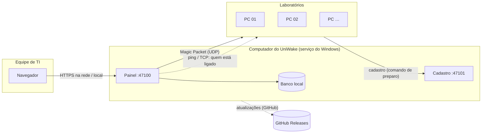

<div align="center">

# ⚡ UniWake

**Ligue, monitore e agende os computadores dos laboratórios da faculdade, direto do navegador.**

Wake-on-LAN por sala, etiqueta ou máquina · Painel em tempo real · Agendamentos com feriados ·
Cadastro automático das máquinas · Atualização automática

[](https://github.com/BryanWalace/UniWake/releases/latest/download/UniWake-Setup.exe)

[](https://github.com/BryanWalace/UniWake/releases)
[](https://github.com/BryanWalace/UniWake/actions/workflows/ci.yml)


[Todas as versões](https://github.com/BryanWalace/UniWake/releases) ·
[Instalação](#-instalação) ·
[Primeiros passos](#-primeiros-passos) ·
[Solução de problemas](#-solução-de-problemas)

</div>

---

## 📋 Sumário

- [Visão geral](#-visão-geral)
- [Funcionalidades](#-funcionalidades)
- [Como funciona](#-como-funciona)
- [Requisitos](#-requisitos)
- [Instalação](#-instalação)
- [Primeiros passos](#-primeiros-passos)
- [Preparar as máquinas](#-preparar-as-máquinas)
- [Uso diário](#-uso-diário)
- [Atualizações](#-atualizações)
- [Backups e restauração](#-backups-e-restauração)
- [Segurança](#-segurança)
- [Solução de problemas](#-solução-de-problemas)
- [Desinstalar](#-desinstalar)
- [Perguntas frequentes](#-perguntas-frequentes)
- [Para desenvolvedores](#-para-desenvolvedores)

---

## 🔭 Visão geral

O UniWake roda como um **serviço do Windows** em um computador da rede (o "computador do
UniWake") e é usado pelo **navegador**. A equipe de TI liga uma sala inteira com um clique, vê em
tempo real quem acordou, agenda as aulas da semana e descobre por que uma máquina não liga.

> Sem servidor dedicado, sem banco de dados para instalar, sem nada a configurar nas máquinas além
> de um único comando.

## ✨ Funcionalidades

| | Recurso | O que faz |
|---|---|---|
| ⚡ | **Ligar pela rede** | Wake-on-LAN por sala, etiqueta ou máquina, com resumo antes de enviar e acompanhamento ao vivo de quem acordou. |
| 📊 | **Painel em tempo real** | Salas com máquinas ligadas, desligadas e desconhecidas; histórico e disponibilidade por dia. |
| 🗓️ | **Agendamentos** | Dias da semana e horário, feriados, pausa para férias e o "Resultado da manhã". |
| 🛠️ | **Preparar máquinas** | Um comando, conferido por SHA-256, ajusta a placa de rede, desliga a Inicialização Rápida, libera o ping e cadastra a máquina na sala. |
| 🔎 | **Descobrir na rede** | Encontra os computadores da rede e cadastra vários de uma vez, com o fabricante de cada placa. |
| 🩺 | **Diagnóstico** | Taxa de sucesso, "parou de acordar", outra sub-rede, **Testar WoL** e páginas de ajuda. |
| 👥 | **Usuários e auditoria** | Perfis administrador e operador; tudo fica registrado e pode ser exportado em CSV. |
| 💾 | **Backups** | Cópia diária automática, antes de cada atualização, e restauração pelo painel. |
| 🔄 | **Atualização automática** | Na janela de manutenção, com volta automática à versão anterior se algo der errado. |
| 🎮 | **Modo demonstração** | Uma rede de laboratórios simulada para conhecer o sistema sem enviar nada. |

## 🧭 Como funciona



1. O painel envia o **Magic Packet** pela placa de rede do computador do UniWake.
2. O UniWake verifica com **ping e TCP** quem acordou e mostra o resultado ao vivo.
3. As máquinas se **cadastram sozinhas** ao rodar o comando de preparo.

## 🧰 Requisitos

| Item | Requisito |
|---|---|
| **Computador do UniWake** | Windows 10 ou 11 (64 bits), sempre ligado, **conectado por cabo** à rede dos laboratórios. Não precisa de ninguém logado. |
| **Máquinas dos laboratórios** | Windows 10 ou 11, placa de rede cabeada com suporte a Wake-on-LAN. |
| **Rede** | Mesma rede (ou VLAN com broadcast dirigido liberado). Veja [Redes diferentes](#redes-diferentes-vlan). |
| **Portas** | 47100 (painel) e 47101 (cadastro), liberadas pelo instalador nas redes de domínio e privadas. |

## 📦 Instalação

### 1. Baixe

<a href="https://github.com/BryanWalace/UniWake/releases/latest/download/UniWake-Setup.exe"></a>

Ou escolha uma versão em **[Releases](https://github.com/BryanWalace/UniWake/releases)**.

> [!NOTE]
> Enquanto a **v1.0.0** não é publicada, o botão acima não encontra o arquivo: baixe a versão
> candidata mais recente (marcada como pré-lançamento) em
> [Releases](https://github.com/BryanWalace/UniWake/releases).

### 2. Confira o arquivo (opcional, recomendado)

Cada versão publica o SHA-256 do instalador em `UniWake-Setup.exe.sha256`. Compare com:

```powershell
Get-FileHash .\UniWake-Setup.exe -Algorithm SHA256
```

### 3. Instale

Execute `UniWake-Setup.exe` **como administrador**. O instalador:

- [x] instala em `C:\Program Files\UniWake` e guarda os dados em `C:\ProgramData\UniWake`
  (acesso só para Administradores e o sistema);
- [x] registra o serviço **UniWake** (início automático, reinicia sozinho se falhar);
- [x] libera as portas **47100** e **47101** no Firewall do Windows (redes de domínio e privadas);
- [x] cria o atalho **UniWake** no menu Iniciar.

<details>
<summary><b>Instalação silenciosa (GPO, scripts)</b></summary>

```powershell
.\UniWake-Setup.exe /VERYSILENT /SUPPRESSMSGBOXES /NORESTART
```

Instalar uma versão nova por cima mantém banco de dados, configurações e usuários. Se você mudar
as portas em **Configurações**, ajuste também as regras "UniWake Painel" e "UniWake Cadastro" do
Firewall: o instalador cria as regras só para as portas padrão.

</details>

## 🚀 Primeiros passos

| Passo | O que fazer |
|:---:|---|
| **1** | No **próprio computador do UniWake**, abra o atalho **UniWake** (ou <http://127.0.0.1:47100>). |
| **2** | Crie o **primeiro administrador**. Por segurança, essa tela só funciona nesse computador. |
| **3** | Cadastre as **salas** em **Salas**. |
| **4** | Cadastre as máquinas: **Preparar máquinas** (recomendado), **Descobrir na rede** ou **Importar CSV**. |
| **5** | Crie os **agendamentos** e pronto. |

**Perfis:** *Administrador* (tudo, inclusive usuários, configurações, logs e backups) e
*Operador* (ligar, agendar, cadastrar máquinas e salas).

<details>
<summary><b>Acessar o painel de outros computadores (HTTPS)</b></summary>

Por padrão o painel só abre no computador do UniWake. Em **Configurações → Painel**, ligue
"Permitir acesso ao painel pela rede", informe o IP deste computador e reinicie o serviço. O
painel passa a abrir em `https://<IP>:47100`, com um certificado criado pelo UniWake.

O navegador avisa que o certificado não é confiável até a TI confiar nele: exporte-o pelo cadeado
do navegador e distribua-o por GPO em "Autoridades de Certificação Raiz Confiáveis", ou envie em
**Configurações** um certificado PFX emitido pela faculdade. Nunca use o painel por HTTP na rede.

</details>

## 🛠️ Preparar as máquinas

Em **Preparar máquinas**, escolha a sala, clique em **Gerar código** e copie o comando. Em cada
máquina, abra o **PowerShell como Administrador**, cole e pressione Enter.

O comando baixa o `prepare-target.ps1` do UniWake, **confere o SHA-256** antes de executar e então:

| Etapa | Ajuste |
|---|---|
| Placa de rede | Permite ligar o computador, **somente com Magic Packet** |
| Windows | Desativa a **Inicialização Rápida** (Fast Startup) |
| Propriedades da placa | Wake on Magic Packet e ligar a partir do desligamento ativados; Ethernet com eficiência energética desligada |
| Firewall | Libera o ping (regra `UniWake-ICMPv4-In`, só domínio e privada) |
| Cadastro | Cadastra a máquina na sala (ou atualiza, ou move de sala) |

No fim aparece um resumo (**OK / FALHOU / NÃO SE APLICA / MANUAL**) e o que conferir na BIOS. O
registro fica em `C:\ProgramData\UniWake-Prepare\`. Para só ver o que mudaria: `-WhatIf`.

> [!WARNING]
> Se aparecer **"Arquivo alterado — não execute"**, não continue e avise a TI.

> [!TIP]
> **Revogue o código** da sala quando terminar: o comando colado fica no histórico do PowerShell
> até o código expirar (8 horas, por padrão).

> [!IMPORTANT]
> A BIOS não pode ser alterada pelo script. Em cada modelo de computador, confira uma vez:
> **Wake on LAN ativado** e **ErP/EuP/Deep Sleep desativado** (dicas para Dell, HP e Lenovo na
> própria página e em **Ajuda**). Depois use **Testar WoL** na página da máquina.

## 🖥️ Uso diário

| Onde | Para quê |
|---|---|
| **Painel** | Contadores e salas; clique em uma sala para ligar ou ver as máquinas. |
| **Ctrl+K** | Ligar rapidamente uma sala, etiqueta ou máquina pelo nome. |
| **Agendamentos** | Dias, horário, salas/etiquetas; feriados e "Pausar agendamentos" (férias). |
| **Histórico** | Cada ligação, quem acordou e quem não respondeu (com link para o diagnóstico). |
| **Dispositivos** | Inventário, importação/exportação CSV, **Descobrir na rede**, diagnóstico e **Testar WoL**. |
| **Saúde do sistema** | Agendador, verificações, relógio, backups, atualizações e avisos do Windows. |

O **"Resultado da manhã"** fica fixado no painel até alguém clicar em **Ciente**.

## 🔄 Atualizações

O UniWake procura versões novas a cada 6 horas (veja em **Saúde do sistema**).

| Modo | Comportamento |
|---|---|
| **Automático** (padrão) | Instala na janela de manutenção (**03:00–05:00**), nunca com uma ligação em andamento ou um agendamento na hora seguinte. |
| **Manual** | Só avisa; um administrador clica em **Atualizar agora**. |

Antes de instalar, o UniWake **confere o SHA-256**, verifica o espaço em disco e faz um **backup**.
Se a versão nova não responder em 2 minutos, ele **volta sozinho** para a anterior (restaurando o
banco, se preciso) e avisa no painel. Uma tarefa de segurança restaura a versão anterior se a
atualização for interrompida (por exemplo, por falta de energia).

## 💾 Backups e restauração

- Backup automático **diário às 02:30**; os últimos **14** são mantidos (configurável).
- Também antes de cada atualização e de cada restauração, e quando você pedir.
- Ficam em `C:\ProgramData\UniWake\backups` — copie essa pasta para outro lugar periodicamente.
- **Restaurar:** **Configurações → Backups**, escolha o backup e digite a data dele para confirmar.

## 🔒 Segurança

- Painel só no próprio computador por padrão; na rede, **somente HTTPS**.
- Senhas com política mínima, bloqueio progressivo contra tentativas, sessões com expiração.
- Códigos de cadastro guardados só como hash, com validade, limite de usos e revogação.
- Comando de preparo **conferido por SHA-256**; instalador e atualizações **conferidos por
  SHA-256**; origem das atualizações fixa no programa.
- **Auditoria** de todas as ações, com exportação CSV protegida contra fórmulas.
- Nenhum dado sai da rede: o UniWake só acessa o GitHub para procurar atualizações.

## 🧯 Solução de problemas

| Sintoma | O que fazer |
|---|---|
| A máquina **não liga** | Abra a máquina em **Dispositivos**, veja o diagnóstico e use **Testar WoL**; confira a BIOS (Wake on LAN, ErP) e rode o preparo de novo. |
| **"Parou de acordar"** | Uma atualização do Windows reativou a Inicialização Rápida ou mudou a placa de rede: rode o comando de preparo de novo. |
| **"Nunca respondeu"** | O firewall da máquina bloqueia o ping: o preparo libera; veja **Ajuda → Firewall e ping**. |
| **"Dispositivo em outra sub-rede"** | Veja [Redes diferentes](#redes-diferentes-vlan). |
| **O serviço não inicia** | Veja o motivo no **Visualizador de Eventos → Aplicativo**, origem **UniWake** (por exemplo, porta 47100 em uso). |
| **Atualização revertida** | O painel mostra o motivo; os detalhes ficam em `C:\ProgramData\UniWake\logs`. |

A página **Ajuda** (no menu) explica as causas mais comuns em detalhe, e **Logs**
(administradores) mostra o log do serviço.

### Redes diferentes (VLAN)

O Magic Packet é um broadcast e **não atravessa roteadores sozinho**. Opções: ligar o computador do
UniWake também na rede dessas máquinas, ou informar o **"Broadcast dirigido"** da sala (ex.:
`10.0.9.255`) em **Salas** e pedir à equipe de rede para permitir broadcast dirigido no roteador.

## 🗑️ Desinstalar

Em **Configurações do Windows → Aplicativos**, desinstale o UniWake. O serviço, as regras de
firewall e o atalho são removidos. Os dados em `C:\ProgramData\UniWake` são **mantidos**, a menos
que você escolha removê-los (a desinstalação silenciosa sempre mantém os dados).

## ❓ Perguntas frequentes

<details>
<summary><b>Funciona com Wi-Fi?</b></summary>

Na prática, não: Wake-on-LAN a partir do computador desligado só funciona pela placa cabeada. O
preparo escolhe a placa cabeada e o UniWake avisa quando um MAC parece ser de Wi-Fi, virtual ou
aleatório.

</details>

<details>
<summary><b>Preciso deixar alguém logado no computador do UniWake?</b></summary>

Não. É um serviço do Windows: começa sozinho quando o computador liga.

</details>

<details>
<summary><b>Posso conhecer o sistema sem mexer na rede?</b></summary>

Sim: o **modo demonstração** simula uma rede de laboratórios e nunca envia pacotes reais (veja
[Para desenvolvedores](#-para-desenvolvedores)).

</details>

<details>
<summary><b>O Windows avisa que o instalador não é reconhecido. É seguro?</b></summary>

O instalador ainda não tem assinatura digital, por isso o SmartScreen avisa. Confira o SHA-256
publicado com a versão antes de instalar. As atualizações automáticas sempre conferem o SHA-256.

</details>

## 👩‍💻 Para desenvolvedores

<details>
<summary><b>Rodar, testar e gerar o instalador</b></summary>

Requisitos: **Node 24** (versão exata em `.nvmrc`) e npm. Código, especificações e commits em
inglês; a interface e este README em português.

```bash
npm ci
npm run dev          # hub em modo demonstração (.dev-data) + painel com recarga automática
npm run verify       # lint, formatação, tipos, testes com cobertura, desempenho, rastreabilidade
npm run e2e          # Playwright (Chromium) contra um hub de demonstração
npm run e2e:edge     # o mesmo no Microsoft Edge (Windows)
npm run test:ps      # PSScriptAnalyzer + Pester (Windows)
npm run stage        # monta build/stage (bundle, painel, node.exe e WinSW conferidos)
```

- O modo demonstração (`--demo`) simula a rede e **nunca envia pacotes reais**; os testes também
  não usam a rede real. Ele se recusa a abrir uma pasta de dados de um UniWake de verdade.
- Depois de uma restauração de backup, o serviço sai com o código 75 para ser reiniciado pelo
  Windows. Em `npm run dev` ninguém reinicia: rode o comando de novo.
- O instalador (Inno Setup) é gerado e testado no CI (`scripts/ci/`): instalação, atualização por
  cima, desinstalação e atualização de ponta a ponta com volta automática.
- Versões são publicadas ao criar uma tag `v*` (`.github/workflows/release.yml`).

| Documento | Conteúdo |
|---|---|
| [`specs/spec.md`](specs/spec.md) | Requisitos e critérios de aceitação |
| [`specs/plan.md`](specs/plan.md) | Arquitetura e plano técnico |
| [`specs/decisions.md`](specs/decisions.md) | Decisões (ADRs) |
| [`specs/validation.md`](specs/validation.md) | Validação da versão |
| [`specs/handoff/NEXT.md`](specs/handoff/NEXT.md) | Estado atual e próximos passos |

</details>

---

<div align="center">

Feito para a equipe de TI da faculdade · [Reportar um problema](https://github.com/BryanWalace/UniWake/issues)

</div>
