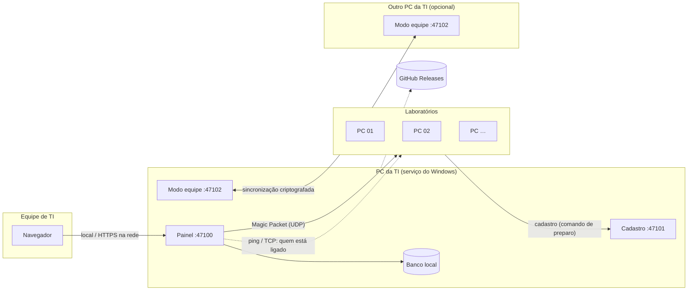
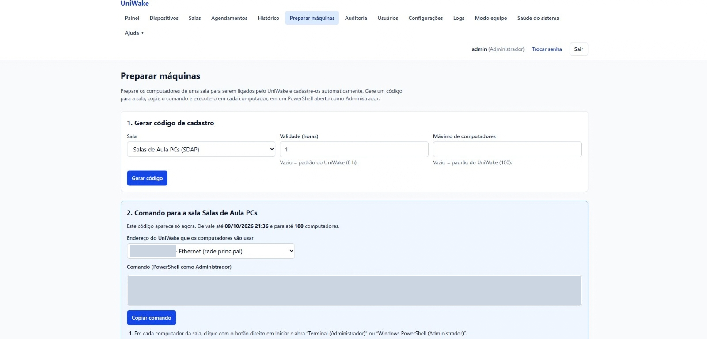
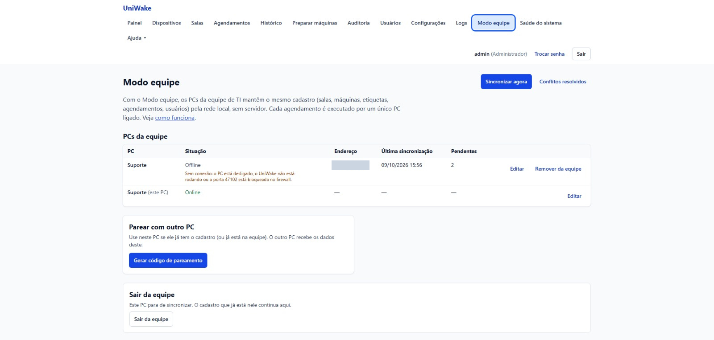
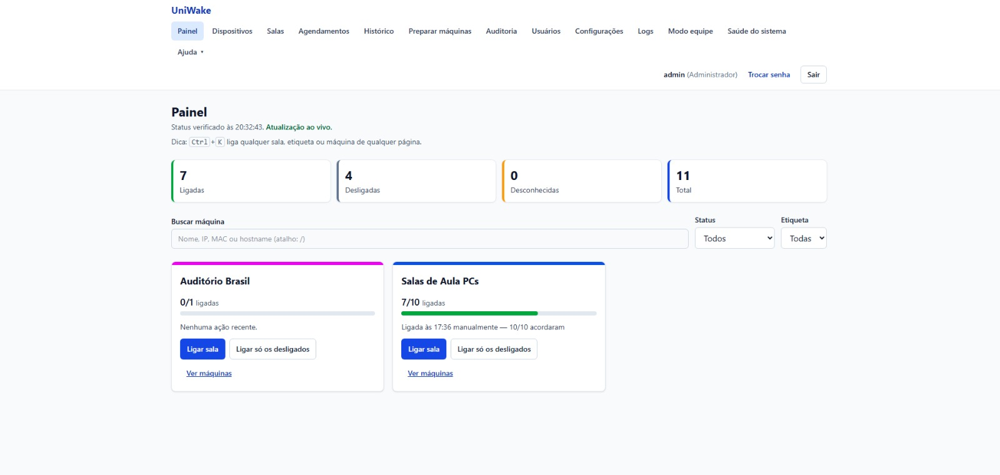
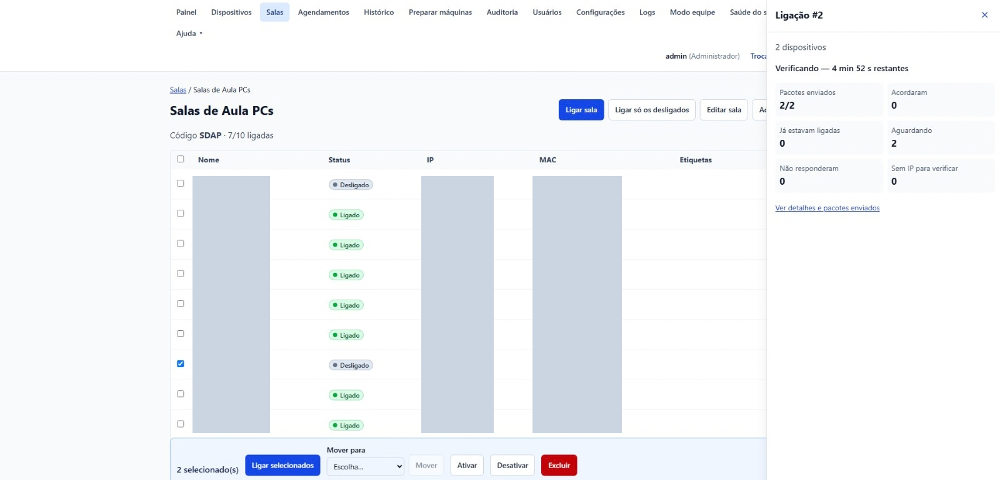
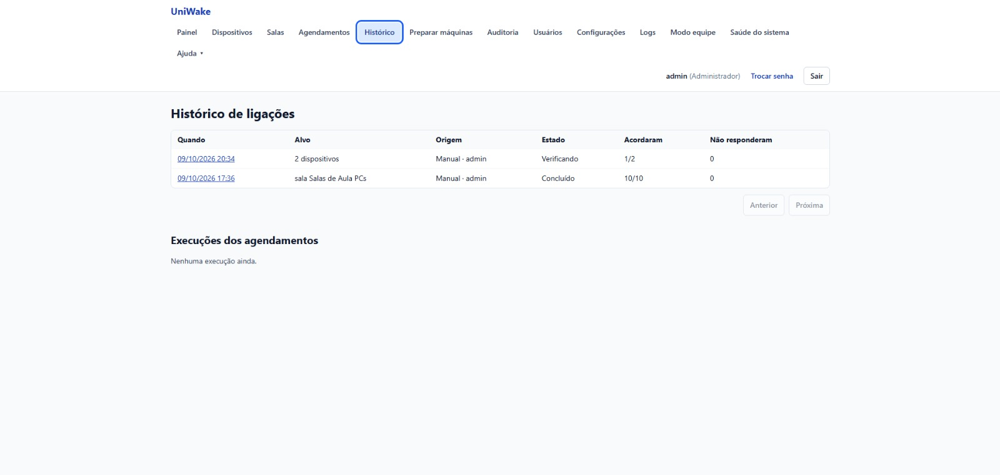
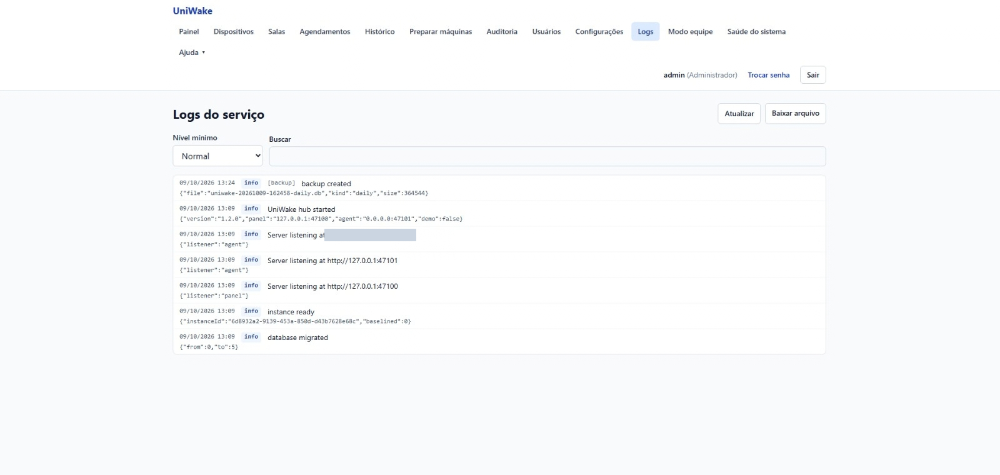

<div align="center">

# ⚡ UniWake

**Ligue, monitore e agende os computadores dos laboratórios da faculdade, direto do navegador.**

Wake-on-LAN por sala, etiqueta ou máquina · Painel em tempo real · Agendamentos com feriados ·
Cadastro automático das máquinas · Descoberta na rede · Modo equipe · Atualização automática

[](https://github.com/BryanWalace/UniWake/releases/latest/download/UniWake-Setup.exe)

[](https://github.com/BryanWalace/UniWake/releases)
[](https://github.com/BryanWalace/UniWake/actions/workflows/ci.yml)


[Todas as versões](https://github.com/BryanWalace/UniWake/releases) ·
[Instalação](#-instalação) ·
[Modo equipe](#-modo-equipe-dois-ou-mais-pcs-da-ti) ·
[Solução de problemas](#-solução-de-problemas) ·
[Relatar problema](#-relatar-problemas-e-sugerir-funções)

</div>

---

## 📋 Sumário

- [Visão geral](#-visão-geral)
- [Funcionalidades](#-funcionalidades)
- [Como funciona](#-como-funciona)
- [Requisitos](#-requisitos)
- [Portas e firewall](#-portas-e-firewall)
- [Instalação](#-instalação)
- [Primeiros passos](#-primeiros-passos)
- [Preparar as máquinas (BIOS + prepare-target.ps1)](#-preparar-as-máquinas)
- [Salas e etiquetas](#-salas-e-etiquetas)
- [Agendamentos](#-agendamentos)
- [Descobrir na rede](#-descobrir-na-rede)
- [Modo equipe (dois ou mais PCs da TI)](#-modo-equipe-dois-ou-mais-pcs-da-ti)
- [Uso diário](#-uso-diário)
- [Atualizações](#-atualizações)
- [Backups e restauração](#-backups-e-restauração)
- [Segurança](#-segurança)
- [Solução de problemas](#-solução-de-problemas)
- [Roadmap](#-roadmap)
- [Relatar problemas e sugerir funções](#-relatar-problemas-e-sugerir-funções)
- [Desinstalar](#-desinstalar)
- [Perguntas frequentes](#-perguntas-frequentes)
- [Para desenvolvedores](#-para-desenvolvedores)
- [Licença](#-licença)

---

## 🔭 Visão geral

O UniWake roda como um **serviço do Windows** no PC de quem cuida da TI e é usado pelo
**navegador**. A equipe liga uma sala inteira com um clique, vê em tempo real quem acordou, agenda
as aulas da semana e descobre por que uma máquina não liga.

Não existe servidor dedicado: se a TI tem mais de uma pessoa (por exemplo, turnos da manhã e da
tarde), cada uma instala o UniWake no próprio PC e o **Modo equipe** mantém os dois com o mesmo
cadastro, sincronizando pela rede local.

> Sem servidor, sem banco de dados para instalar, sem nada a configurar nas máquinas além de um
> único comando.

## ✨ Funcionalidades

| | Recurso | O que faz |
|---|---|---|
| ⚡ | **Ligar pela rede** | Wake-on-LAN por sala, etiqueta ou máquina, com resumo antes de enviar e acompanhamento ao vivo de quem acordou. |
| 📊 | **Painel em tempo real** | Salas com máquinas ligadas, desligadas e desconhecidas; histórico e disponibilidade por dia. |
| 🗓️ | **Agendamentos** | Dias da semana e horário, feriados, pausa para férias e o "Resultado da manhã". |
| 🛠️ | **Preparar máquinas** | Um comando, conferido por SHA-256, ajusta a placa de rede, desliga a Inicialização Rápida, libera o ping e cadastra a máquina na sala. |
| 🔎 | **Descobrir na rede** | Encontra os computadores da rede e cadastra vários de uma vez, com o fabricante de cada placa. |
| 🤝 | **Modo equipe** | Dois ou mais PCs da TI pareados por um código de 6 dígitos mantêm o mesmo cadastro; cada agendamento roda em um só PC ligado. |
| 🩺 | **Diagnóstico** | Taxa de sucesso, "parou de acordar", outra sub-rede, **Testar WoL** e páginas de ajuda. |
| 👥 | **Usuários e auditoria** | Perfis administrador e operador; tudo fica registrado e pode ser exportado em CSV. |
| 💾 | **Backups** | Cópia diária automática, antes de cada atualização, e restauração pelo painel. |
| 🔄 | **Atualização automática** | Na janela de manutenção, com volta automática à versão anterior se algo der errado. |
| 🎮 | **Modo demonstração** | Uma rede de laboratórios simulada para conhecer o sistema sem enviar nada. |

> [!NOTE]
> O **Modo equipe** chegou na versão **1.2.0**. Quem já tem o UniWake instalado recebe a
> atualização sozinho, na janela de manutenção.

## 🧭 Como funciona



1. O painel envia o **Magic Packet** pela placa de rede do PC da TI.
2. O UniWake verifica com **ping e TCP** quem acordou e mostra o resultado ao vivo.
3. As máquinas se **cadastram sozinhas** ao rodar o comando de preparo.
4. No Modo equipe, os PCs da TI trocam as alterações pela porta **47102**, cifradas com a chave da
   equipe.

## 🧰 Requisitos

| Item | Requisito |
|---|---|
| **PC da TI** | Windows 10 ou 11 (64 bits), **conectado por cabo** à rede dos laboratórios. Não precisa de ninguém logado. Para os agendamentos da manhã, ele (ou outro PC da equipe) precisa estar ligado no horário. |
| **Máquinas dos laboratórios** | Windows 10 ou 11, placa de rede cabeada com suporte a Wake-on-LAN. |
| **Rede** | Mesma rede (ou VLAN com broadcast dirigido liberado). Veja [Redes diferentes](#redes-diferentes-vlan). |
| **Portas** | 47100 (painel), 47101 (cadastro) e 47102 TCP+UDP (Modo equipe), liberadas pelo instalador nas redes de domínio e privadas. Veja [Portas e firewall](#-portas-e-firewall). |

## 🔌 Portas e firewall

O instalador cria as regras de entrada no Firewall do Windows do PC do UniWake. Sem elas (ou com
um firewall no caminho), as funções abaixo **não funcionam**:

| Porta | Protocolo | Quem acessa o PC do UniWake | Sem ela… |
|---|---|---|---|
| **47100** | TCP | O navegador. Por padrão só no próprio PC; na rede, só por HTTPS (opcional). | o painel não abre de outros computadores (se você ligou o acesso pela rede). |
| **47101** | TCP | **As máquinas dos laboratórios**, ao rodar o comando de **Preparar máquinas**: elas baixam o `prepare-target.ps1` e se cadastram por esta porta. | **o comando de preparo/cadastro falha** ("Não é possível conectar ao servidor remoto") e a máquina não é cadastrada. |
| **47102** | TCP e UDP | Os outros PCs da TI no **Modo equipe** (pareamento, anúncios e sincronização). | o pareamento falha e o outro PC aparece "offline / Sem conexão". |

> [!IMPORTANT]
> As regras valem só para redes **Domínio** e **Privada**. Se a rede do PC do UniWake estiver como
> **Pública** (Configurações → Rede e Internet → Ethernet → Tipo de perfil de rede), as portas ficam
> fechadas: mude para Privada (ou peça à TI para usar o perfil de domínio).

**Testar** de uma máquina do laboratório (ou do outro PC da TI), no PowerShell:

```powershell
Test-NetConnection <IP-do-PC-do-UniWake> -Port 47101   # cadastro (Preparar máquinas)
Test-NetConnection <IP-do-PC-do-UniWake> -Port 47102   # Modo equipe
```

`TcpTestSucceeded : True` = a porta está aberta. Se der `False`, confira o perfil da rede, um
antivírus com firewall próprio, uma GPO do domínio ou um firewall entre as redes (VLANs).

<details>
<summary><b>Recriar as regras à mão (PowerShell como Administrador, no PC do UniWake)</b></summary>

```powershell
netsh advfirewall firewall add rule name="UniWake Cadastro" dir=in action=allow protocol=TCP localport=47101 profile=domain,private
netsh advfirewall firewall add rule name="UniWake - Modo equipe" dir=in action=allow protocol=TCP localport=47102 profile=domain,private
netsh advfirewall firewall add rule name="UniWake - Modo equipe" dir=in action=allow protocol=UDP localport=47102 profile=domain,private
```

</details>

## 📦 Instalação

### 1. Baixe

<a href="https://github.com/BryanWalace/UniWake/releases/latest/download/UniWake-Setup.exe"></a>

Ou escolha uma versão em **[Releases](https://github.com/BryanWalace/UniWake/releases)**.

> [!NOTE]
> O botão sempre baixa a **versão estável mais recente** (a partir da 1.2.0). Versões candidatas
> (pré-lançamentos) ficam só na página de Releases.

### 2. Confira o arquivo (opcional, recomendado)

Cada versão publica o SHA-256 do instalador em `UniWake-Setup.exe.sha256`. Compare com:

```powershell
Get-FileHash .\UniWake-Setup.exe -Algorithm SHA256
```

### 3. Instale

Execute `UniWake-Setup.exe` **como administrador**. O instalador:

- [x] instala em `C:\Program Files\UniWake` e guarda os dados em `C:\ProgramData\UniWake`
  (acesso só para Administradores e o sistema);
- [x] registra o serviço **UniWake** (início automático, reinicia sozinho se falhar);
- [x] libera no Firewall do Windows (redes de domínio e privadas) as portas **47100** e **47101** e,
  a partir da 1.2, a **47102 TCP e UDP** do Modo equipe (regra "UniWake - Modo equipe");
- [x] cria o atalho **UniWake** no menu Iniciar.

<details>
<summary><b>Instalação silenciosa (GPO, scripts)</b></summary>

```powershell
.\UniWake-Setup.exe /VERYSILENT /SUPPRESSMSGBOXES /NORESTART
```

Instalar uma versão nova por cima mantém banco de dados, configurações e usuários. Se você mudar
as portas em **Configurações**, ajuste também as regras "UniWake Painel", "UniWake Cadastro" e
"UniWake - Modo equipe" do Firewall: o instalador cria as regras só para as portas padrão.

</details>

## 🚀 Primeiros passos

| Passo | O que fazer |
|:---:|---|
| **1** | No **próprio PC da TI**, abra o atalho **UniWake** (ou <http://127.0.0.1:47100>). |
| **2** | Crie o **primeiro administrador**. Por segurança, essa tela só funciona nesse computador. |
| **3** | Cadastre as **salas** em **Salas** (e, se quiser, etiquetas). |
| **4** | Cadastre as máquinas: **Preparar máquinas** (recomendado), **Descobrir na rede** ou **Importar CSV**. |
| **5** | Crie os **agendamentos**. |
| **6** | Tem um colega com outro PC? Pareie os dois no [Modo equipe](#-modo-equipe-dois-ou-mais-pcs-da-ti). |

**Perfis:** *Administrador* (tudo, inclusive usuários, configurações, logs, backups e Modo equipe)
e *Operador* (ligar, agendar, cadastrar máquinas e salas).

<details>
<summary><b>Acessar o painel de outros computadores (HTTPS)</b></summary>

Por padrão o painel só abre no próprio PC. Em **Configurações → Acesso ao painel**, ligue
"Permitir acesso ao painel pela rede", informe o IP deste computador e reinicie o serviço. O
painel passa a abrir em `https://<IP>:47100`, com um certificado criado pelo UniWake.

O navegador avisa que o certificado não é confiável até a TI confiar nele: exporte-o pelo cadeado
do navegador e distribua-o por GPO em "Autoridades de Certificação Raiz Confiáveis", ou envie em
**Configurações** um certificado PFX emitido pela faculdade. Nunca use o painel por HTTP na rede.

</details>

## 🛠️ Preparar as máquinas

São duas partes: a **BIOS** (uma vez por modelo de computador, à mão) e o **comando de preparo**
(uma vez por máquina, em segundos).

### 1. BIOS/UEFI (uma vez por modelo)

Nenhum script consegue alterar a BIOS. Entre nela ao ligar (normalmente **F2, F10, F1 ou Del**) e
confira:

| Opção (os nomes variam) | Valor |
|---|---|
| Wake on LAN / Power On by PCI-E / Remote Wake Up | **Ativado** |
| ErP / EuP / Deep Sleep / "Block Sleep" | **Desativado** (senão a placa de rede fica sem energia) |
| Dell | *Power Management → Wake on LAN = LAN Only*; *Deep Sleep Control = Disabled* |
| HP | *Advanced → Power-On Options → Remote Wake Up Boot Source = Remote Server*; *S5 Wake on LAN = Enabled* |
| Lenovo | *Power → Wake on LAN = Automatic ou Primary*; *Enhanced Power Saving Mode = Disabled* |

### 2. Comando de preparo (`prepare-target.ps1`)

Em **Preparar máquinas**, escolha a sala, clique em **Gerar código** e copie o comando. Em cada
máquina, abra o **PowerShell como Administrador**, cole e pressione Enter.


<sub>Preparar máquinas: escolha a sala, gere o código e copie o comando (endereço e comando ocultados na imagem).</sub>

> [!IMPORTANT]
> **A porta 47101 (TCP) do PC do UniWake precisa estar liberada** para as máquinas dos
> laboratórios: é por ela que o comando baixa o script e cadastra a máquina. Se ela estiver
> bloqueada, o comando falha com "Não é possível conectar ao servidor remoto". Teste com
> `Test-NetConnection <IP-do-PC-do-UniWake> -Port 47101` e veja [Portas e firewall](#-portas-e-firewall).

O comando baixa o `prepare-target.ps1` do UniWake, **confere o SHA-256** antes de executar e então:

| Etapa | Ajuste |
|---|---|
| Placa de rede | Permite ligar o computador, **somente com Magic Packet** |
| Windows | Desativa a **Inicialização Rápida** (Fast Startup) |
| Propriedades da placa | Wake on Magic Packet e ligar a partir do desligamento ativados; Ethernet com eficiência energética desligada |
| Firewall | Libera o ping (regra `UniWake-ICMPv4-In`, só domínio e privada) |
| Cadastro | Cadastra a máquina na sala (ou atualiza, ou move de sala) |

No fim aparece um resumo (**OK / FALHOU / NÃO SE APLICA / MANUAL**) e o que conferir na BIOS. O
registro fica em `C:\ProgramData\UniWake-Prepare\`. Para só ver o que mudaria: `-WhatIf`.

> [!WARNING]
> Se aparecer **"Arquivo alterado — não execute"**, não continue e avise a TI.

> [!TIP]
> **Revogue o código** da sala quando terminar: o comando colado fica no histórico do PowerShell
> até o código expirar (8 horas, por padrão). Depois, use **Testar WoL** na página da máquina.

## 🏷️ Salas e etiquetas

- **Salas** agrupam as máquinas por lugar (bloco, andar, laboratório). Cada sala tem cor, código
  (usado no comando de preparo), lote e intervalo de ligação próprios e, se ficar em outra rede, um
  **broadcast dirigido**. Excluir uma sala manda as máquinas para "Sem sala".
- **Etiquetas** agrupam por característica, atravessando salas: "Projetor", "Professor",
  "Servidor"… Você pode ligar ou agendar por etiqueta.
- Uma ação vale **só para o alvo escolhido**: ligar a sala A nunca envia pacotes para a sala B.
  Ações grandes (mais de 40 máquinas, várias salas ou "Todos") pedem confirmação.

## 🗓️ Agendamentos

- Dias da semana + horário (fuso padrão **America/Sao_Paulo**), para salas, etiquetas, máquinas ou
  todas; opção "só as desligadas" e lote próprio.
- **Exceções**: feriados e recessos (globais ou por agendamento) aparecem como `pulado (feriado)`.
- **Pausar agendamentos** (férias) exige um motivo e pode voltar sozinho numa data; uma faixa
  vermelha avisa em todas as páginas.
- Se o PC estava desligado no horário e liga em até **15 minutos**, o agendamento roda atrasado;
  depois disso fica como `perdido` (no Modo equipe, veja abaixo).
- O **Resultado da manhã** mostra, por sala, quem não acordou e fica fixado no painel até alguém
  clicar em **Ciente**.

## 🔎 Descobrir na rede

Em **Dispositivos → Descobrir na rede**, o UniWake varre **apenas as sub-redes deste PC**, lista os
computadores encontrados (IP, MAC, nome e fabricante da placa) e marca os que já estão cadastrados.
Escolha vários e cadastre de uma vez numa sala. O roteador (gateway) fica de fora, e MACs de Wi-Fi,
virtuais ou aleatórios são sinalizados.

## 🤝 Modo equipe (dois ou mais PCs da TI)

> Disponível a partir da versão **1.2**.

Não existe servidor ligado o tempo todo: cada pessoa da TI roda o UniWake no próprio PC. O Modo
equipe mantém esses PCs com o **mesmo cadastro** e garante que cada agendamento seja executado por
**um único PC** ligado.

### Parear dois PCs

1. No PC que **já tem o cadastro**, abra **Modo equipe** e clique em **Gerar código de pareamento**.
   Aparecem um código de **6 dígitos** (válido por **5 minutos**, uso único) e o endereço do PC.
2. No outro PC, abra **Modo equipe → Entrar em uma equipe**, escolha o PC na lista (ou digite o
   endereço) e digite o código.
3. Se o PC que entra já tinha cadastro, ele é **substituído** pelo da equipe: um backup é feito antes
   e é preciso digitar `SUBSTITUIR`. Depois, use os **usuários e senhas da equipe**.

O código nunca passa pela rede: ele autentica uma troca de chaves (SPAKE2), e 5 erros cancelam o
código. A chave da equipe fica guardada cifrada pelo Windows (DPAPI) em cada PC.


<sub>Modo equipe: os PCs da equipe, situação, última sincronização e alterações pendentes (endereço ocultado na imagem).</sub>

### Como a sincronização funciona

- Sincronizado: salas, máquinas, etiquetas, agendamentos, exceções, pausa, usuários e configurações
  gerais. **Não** sincronizado: configurações marcadas "Somente neste PC" (placas de rede, endereço
  do painel, atualização, backup, portas), histórico, ligações, logs, auditoria e backups.
- Os PCs se anunciam na rede a cada 15 s e trocam as alterações a cada 30 s (e logo depois de cada
  mudança). A conexão é TLS 1.3 com a chave da equipe; um PC removido não entra mais.
- Mesmo item alterado nos dois PCs antes de sincronizar: **vale a alteração mais recente**, igual em
  todos; o caso aparece em **Conflitos resolvidos**. A mesma máquina (MAC) cadastrada nos dois vira
  uma só; salas ou etiquetas com o mesmo nome ficam as duas, uma renomeada para "(2)".
- **Agendamentos:** entre os PCs ligados, um só executa; se ele não executar em 90 s, outro
  executa. Um PC que liga depois do horário **não** executa sozinho o que perdeu: ele mostra
  "Agendamento não executado" com **Ligar agora**, se nenhum outro PC registrou a execução.
- A página mostra, para cada PC: online/offline, última sincronização, alterações pendentes e o
  último erro; **Sincronizar agora** força uma rodada.

### Firewall e PCs em outras sub-redes

- A porta **47102 (TCP e UDP)** precisa estar liberada entre os PCs da equipe. O instalador cria a
  regra "UniWake - Modo equipe" para redes de domínio e privadas; uma política do domínio, um
  antivírus ou a rede como "Pública" podem bloquear mesmo assim (o PC aparece "offline" com "Sem
  conexão"). Teste com `Test-NetConnection <IP-do-outro-PC> -Port 47102`
  ([Portas e firewall](#-portas-e-firewall)).
- PCs na mesma rede se encontram sozinhos. Para um PC em **outra sub-rede**, clique em **Editar** na
  lista e informe um **endereço fixo** (nome do computador ou IP).
- **Remover da equipe** troca a chave da equipe; os PCs que estavam desligados recebem a chave nova
  quando ligam. **Sair da equipe** para a sincronização neste PC (o cadastro continua nele).

> [!TIP]
> Para a ligação da manhã funcionar sem ninguém por perto, deixe pelo menos um PC da equipe ligado
> no horário ou configure na BIOS dele **Power On by RTC** (ligar em horário programado) alguns
> minutos antes do primeiro agendamento.

## 🖥️ Uso diário

| Onde | Para quê |
|---|---|
| **Painel** | Contadores e salas; clique em uma sala para ligar ou ver as máquinas. |
| **Ctrl+K** | Ligar rapidamente uma sala, etiqueta ou máquina pelo nome. |
| **Agendamentos** | Dias, horário, salas/etiquetas; feriados e "Pausar agendamentos" (férias). |
| **Histórico** | Cada ligação, quem acordou e quem não respondeu (com link para o diagnóstico). |
| **Dispositivos** | Inventário, importação/exportação CSV, **Descobrir na rede**, diagnóstico e **Testar WoL**. |
| **Modo equipe** | PCs da equipe, sincronização, conflitos resolvidos (administradores). |
| **Saúde do sistema** | Agendador, verificações, relógio, backups, atualizações, avisos do Windows e o identificador deste PC. |
| **Ajuda** | Páginas de ajuda, **Relatar problema** e **Sugerir função**. |


<sub>Painel: máquinas ligadas, desligadas e desconhecidas, e as salas com "Ligar sala" e "Ligar só os desligados".</sub>


<sub>Ligar uma sala ou máquinas selecionadas e acompanhar ao vivo quem acordou (nomes, IPs e MACs ocultados na imagem).</sub>


<sub>Histórico: cada ligação, quem acordou e quem não respondeu, e as execuções dos agendamentos.</sub>

## 🔄 Atualizações

O UniWake procura versões novas a cada 6 horas (veja em **Saúde do sistema**).

| Modo | Comportamento |
|---|---|
| **Automático** (padrão) | Instala na janela de manutenção (**03:00–05:00**), nunca com uma ligação em andamento ou um agendamento na hora seguinte. |
| **Manual** | Só avisa; um administrador clica em **Atualizar agora**. |

Antes de instalar, o UniWake **confere o SHA-256**, verifica o espaço em disco e faz um **backup**.
Se a versão nova não responder em 2 minutos, ele **volta sozinho** para a anterior (restaurando o
banco, se preciso) e avisa no painel. Uma tarefa de segurança restaura a versão anterior se a
atualização for interrompida (por exemplo, por falta de energia). No Modo equipe, cada PC se
atualiza sozinho, na própria janela de manutenção.

## 💾 Backups e restauração

- Backup automático **diário às 02:30**; os últimos **14** são mantidos (configurável).
- Também antes de cada atualização, de cada restauração e antes de um PC entrar numa equipe, e
  quando você pedir.
- Ficam em `C:\ProgramData\UniWake\backups` — copie essa pasta para outro lugar periodicamente.
- **Restaurar:** **Configurações → Backups**, escolha o backup e digite a data dele para confirmar.
  Um backup restaurado vale para o mesmo PC (as chaves do Modo equipe só abrem nele).

## 🔒 Segurança

- Painel só no próprio computador por padrão; na rede, **somente HTTPS**.
- Senhas com política mínima, bloqueio progressivo contra tentativas, sessões com expiração.
- Códigos de cadastro guardados só como hash, com validade, limite de usos e revogação.
- Comando de preparo **conferido por SHA-256**; instalador e atualizações **conferidos por
  SHA-256**; origem das atualizações fixa no programa.
- Modo equipe: pareamento por código que não trafega (SPAKE2), sincronização TLS 1.3 com a chave da
  equipe, chave guardada com DPAPI, PCs removidos ficam de fora.
- **Auditoria** de todas as ações, com exportação CSV protegida contra fórmulas.
- Nenhum dado sai da rede: o UniWake só acessa o GitHub para procurar atualizações.
- Encontrou uma falha? Veja o [SECURITY.md](SECURITY.md) (não abra issue pública).

## 🧯 Solução de problemas

| Sintoma | O que fazer |
|---|---|
| A máquina **não liga** | Abra a máquina em **Dispositivos**, veja o diagnóstico e use **Testar WoL**. |
| **Inicialização Rápida (Fast Startup)** | Com ela, o Windows hiberna em vez de desligar e a placa não espera o pacote. Rode o comando de preparo de novo (ele desliga) ou: Painel de Controle → Opções de Energia → "Escolher a função dos botões de energia" → desmarque "Ligar inicialização rápida". |
| **BIOS / ErP** | Wake on LAN precisa estar ativado e **ErP/EuP/Deep Sleep desativado** — veja [a tabela da BIOS](#1-biosuefi-uma-vez-por-modelo). |
| **"Parou de acordar"** | Uma atualização do Windows reativou a Inicialização Rápida ou mudou a placa de rede: rode o comando de preparo de novo. |
| **"Nunca respondeu" / ping bloqueado** | O firewall da máquina bloqueia o ICMP e ela parece desligada: o preparo cria a regra `UniWake-ICMPv4-In`; uma GPO pode bloquear — o UniWake também testa portas TCP (135, 445, 3389). |
| **O comando de Preparar máquinas falha** ("Não é possível conectar ao servidor remoto") | A máquina não alcança o PC do UniWake na porta **47101**: confira o perfil de rede (Privada/Domínio), o firewall/antivírus do PC do UniWake e firewalls entre as redes; teste com `Test-NetConnection <IP> -Port 47101`. Veja [Portas e firewall](#-portas-e-firewall). |
| **"Dispositivo em outra sub-rede" / VLAN** | O broadcast não atravessa roteadores: veja [Redes diferentes](#redes-diferentes-vlan). |
| **Modo equipe: PC "offline" / "Sem conexão"** | O outro PC está desligado, o UniWake não roda nele, ou a porta **47102** está bloqueada. Em outra sub-rede, informe um endereço fixo. |
| **Modo equipe: "as chaves não conferem"** | O PC ficou desligado durante duas trocas de chave (remoções): saia da equipe e pareie de novo. |
| **O serviço não inicia** | Veja o motivo no **Visualizador de Eventos → Aplicativo**, origem **UniWake** (por exemplo, porta 47100 em uso). |
| **Atualização revertida** | O painel mostra o motivo; os detalhes ficam em `C:\ProgramData\UniWake\logs`. |

O menu **Ajuda** explica as causas mais comuns em detalhe, e **Logs** (administradores) mostra o
log do serviço, com filtro por nível e busca; **Baixar arquivo** gera o log para anexar a um relato
de problema (revise IPs e nomes antes de publicar).


<sub>Logs do serviço (endereço ocultado na imagem).</sub>

### Redes diferentes (VLAN)

O Magic Packet é um broadcast e **não atravessa roteadores sozinho**. Opções: ligar o PC da TI
também na rede dessas máquinas, ou informar o **"Broadcast dirigido"** da sala (ex.:
`10.0.9.255`) em **Salas** e pedir à equipe de rede para permitir broadcast dirigido no roteador.

## 🗺️ Roadmap

| Versão | Conteúdo | Situação |
|---|---|---|
| 1.0 | Ligar pela rede, painel, agendamentos, preparo e cadastro, usuários, backups, atualização automática | ✅ publicada (incluída na 1.2.0) |
| 1.1 | Descobrir na rede | ✅ publicada (incluída na 1.2.0) |
| 1.2 | **Modo equipe** (sincronização entre PCs da TI) | ✅ publicada (1.2.0) |
| 1.3 | UniWake Agent: **desligar e reiniciar** pela rede ou por agendamento, aviso na tela com contagem regressiva | 🕒 planejado |
| 1.4 | **Backup, restauração e migração** em arquivo `.uniwake` (exportar/importar, com senha) | 🕒 planejado |
| — | Agente por VLAN, notificações (e-mail/Telegram), ferramentas de BIOS dos fabricantes, permissões por sala | 💡 ideias |

## 🐞 Relatar problemas e sugerir funções

- No painel: menu **Ajuda → Relatar problema** ou **Sugerir função** (abre o GitHub com a versão já
  preenchida).
- Ou direto em [Issues](https://github.com/BryanWalace/UniWake/issues/new/choose): formulários de
  **problema**, **sugestão** e **dúvida**.
- **Não publique** IPs, MACs, nomes de computadores, senhas ou tokens reais da instituição.
- **Vulnerabilidades** vão pelo relato privado do GitHub: veja o [SECURITY.md](SECURITY.md).
- Quer contribuir com código? Veja o [CONTRIBUTING.md](CONTRIBUTING.md).

## 🗑️ Desinstalar

Em **Configurações do Windows → Aplicativos**, desinstale o UniWake. O serviço, as regras de
firewall e o atalho são removidos. Os dados em `C:\ProgramData\UniWake` são **mantidos**, a menos
que você escolha removê-los (a desinstalação silenciosa sempre mantém os dados). Se o PC estava
numa equipe, remova-o antes em **Modo equipe** de outro PC.

## ❓ Perguntas frequentes

<details>
<summary><b>Funciona com Wi-Fi?</b></summary>

Na prática, não: Wake-on-LAN a partir do computador desligado só funciona pela placa cabeada. O
preparo escolhe a placa cabeada e o UniWake avisa quando um MAC parece ser de Wi-Fi, virtual ou
aleatório.

</details>

<details>
<summary><b>Preciso deixar alguém logado no PC da TI?</b></summary>

Não. É um serviço do Windows: começa sozinho quando o computador liga.

</details>

<details>
<summary><b>Com dois PCs na equipe, o laboratório pode ser ligado duas vezes?</b></summary>

Não no uso normal: os PCs ligados escolhem um só executor para cada agendamento. Se um PC não
enxergar o outro (por exemplo, firewall bloqueando a porta 47102), os dois podem executar — o que
liga as máquinas duas vezes, mas nunca deixa de ligar.

</details>

<details>
<summary><b>Posso conhecer o sistema sem mexer na rede?</b></summary>

Sim: o **modo demonstração** simula uma rede de laboratórios e nunca envia pacotes reais (veja
[Para desenvolvedores](#-para-desenvolvedores)).

</details>

<details>
<summary><b>O Windows avisa que o instalador não é reconhecido. É seguro?</b></summary>

O instalador ainda não tem assinatura digital, por isso o SmartScreen avisa. Confira o SHA-256
publicado com a versão antes de instalar. As atualizações automáticas sempre conferem o SHA-256.

</details>

## 👩‍💻 Para desenvolvedores

<details>
<summary><b>Rodar, testar e gerar o instalador</b></summary>

Requisitos: **Node 24** (versão exata em `.nvmrc`) e npm. Código, especificações e commits em
inglês; a interface e este README em português. O fluxo de branches, os testes e os rótulos estão no
[CONTRIBUTING.md](CONTRIBUTING.md) (trabalho na branch `dev`).

```bash
npm ci
npm run dev          # hub em modo demonstração (.dev-data) + painel com recarga automática
npm run verify       # lint, formatação, tipos, testes com cobertura, desempenho, rastreabilidade
npm run e2e          # Playwright (Chromium) contra hubs de demonstração (inclui dois PCs em equipe)
npm run e2e:edge     # o mesmo no Microsoft Edge (Windows)
npm run test:ps      # PSScriptAnalyzer + Pester (Windows)
npm run stage        # monta build/stage (bundle, painel, node.exe e WinSW conferidos)
```

- O modo demonstração (`--demo`) simula a rede e **nunca envia pacotes reais**; os testes também
  não usam a rede real (o Modo equipe dos testes fica em `127.0.0.1`). Ele se recusa a abrir uma
  pasta de dados de um UniWake de verdade.
- Depois de uma restauração de backup, o serviço sai com o código 75 para ser reiniciado pelo
  Windows. Em `npm run dev` ninguém reinicia: rode o comando de novo.
- O instalador (Inno Setup) é gerado e testado no CI (`scripts/ci/`): instalação, atualização por
  cima, desinstalação, regras de firewall e atualização de ponta a ponta com volta automática.
- Versões são publicadas pelo mantenedor ao criar uma tag `v*` na `main`
  (`.github/workflows/release.yml`).

| Documento | Conteúdo |
|---|---|
| [`specs/spec.md`](specs/spec.md) | Requisitos e critérios de aceitação |
| [`specs/plan.md`](specs/plan.md) | Arquitetura e plano técnico |
| [`specs/decisions.md`](specs/decisions.md) | Decisões (ADRs) |
| [`specs/validation.md`](specs/validation.md) | Validação das versões |
| [`specs/handoff/NEXT.md`](specs/handoff/NEXT.md) | Estado atual e próximos passos |

</details>

## 📄 Licença

Ainda não há uma licença publicada: o projeto está marcado como `UNLICENSED` (todos os direitos
reservados ao mantenedor). Para usar, copiar ou redistribuir o código, peça autorização ao mantenedor.

---

<div align="center">

Feito para a equipe de TI da faculdade · [Relatar um problema](https://github.com/BryanWalace/UniWake/issues/new/choose)

</div>
