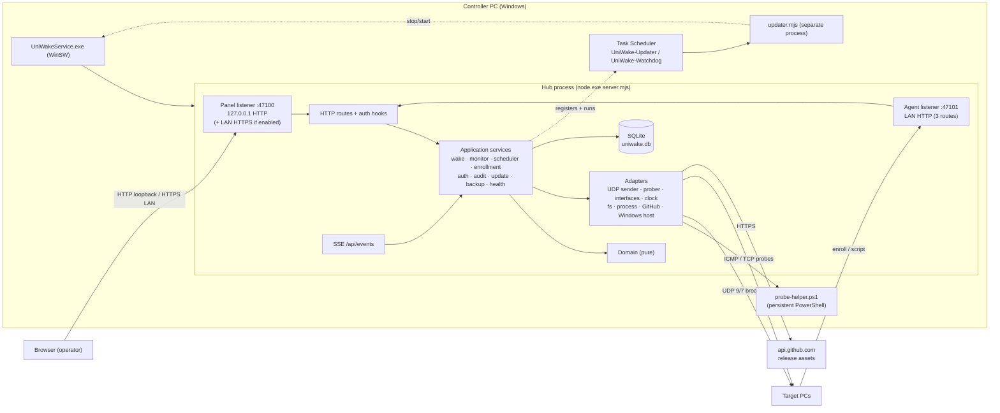
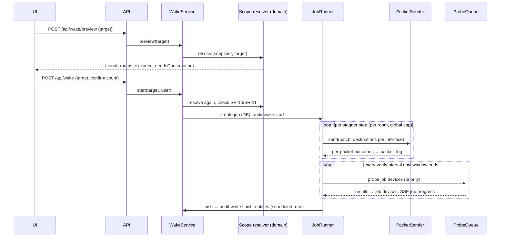
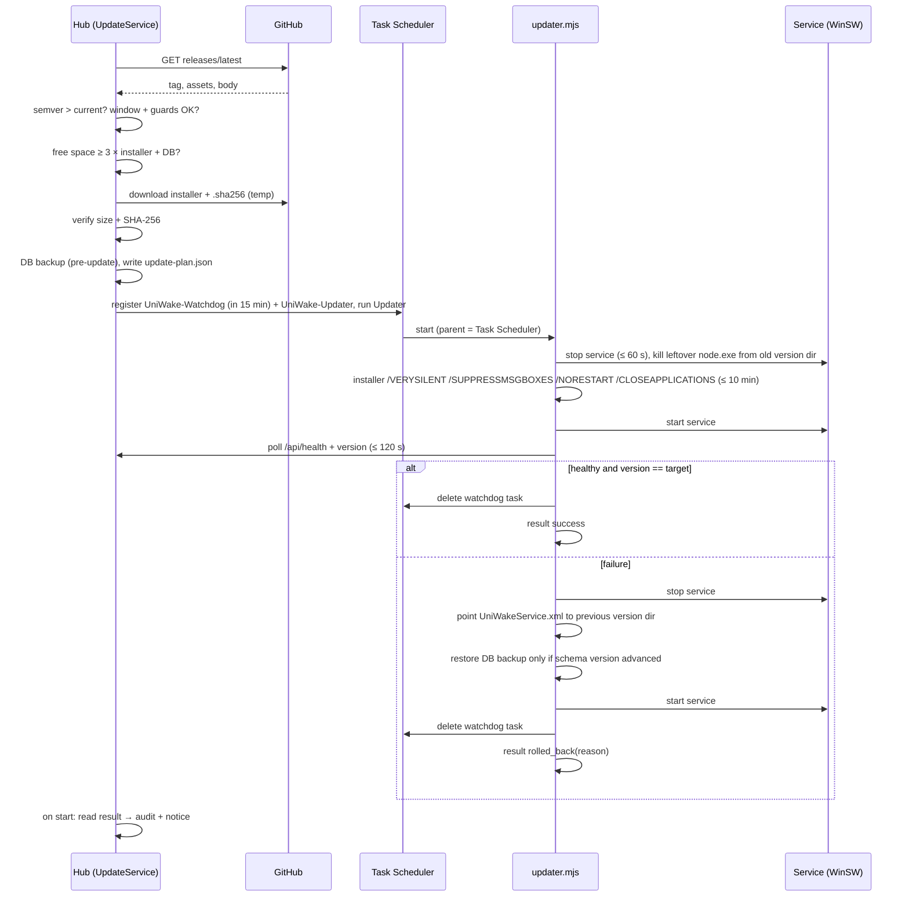

# UniWake — Technical Plan

Version: **1.2** · Date: 2026-10-09 · Owner: Architect
History: v0.1 draft → reviewed in `specs/reviews/phase-2-*.md` → consolidated as v1.0 → v1.1
(Phase 6: §5.2 sync-ready data, §7.2 lease, ADR-030..034) → v1.2 (Phase 7: §14 team mode,
ADR-035..040).
Inputs: `specs/constitution.md` v1.1, `specs/spec.md` v1.0, ADR-001..026.

---

## 1. Spikes run before this plan (dev machine, Node 24.15, Windows 11)
| Spike | Result | Consequence |
|---|---|---|
| `node:sqlite` | WAL, `synchronous=FULL`, prepared statements, transactions, `backup()` and `VACUUM INTO` work; unique violation → `errcode 2067`; no experimental warning. | Built-in driver (ADR-017). |
| `crypto.argon2('argon2id')` | m=19 MiB, t=2, p=1 → 44 ms. | Built-in argon2id (ADR-018). |
| Persistent PowerShell helper (`Ping.SendPingAsync`) | 250 loopback pings in 528 ms incl. process start; locale-independent status enum. | Primary ICMP (ADR-019). |
| `ping.exe` | 64 concurrent spawns in 454 ms; **output localized** ("Resposta de… tempo<1ms"). | Fallback only; parse `TTL=`. |
| `Get-NetIPConfiguration` | ~4 s per call. | Not used at send time. |
| `route.exe print -4` | 73 ms; numeric default-route rows. | Gateway detection. |
| `os.networkInterfaces()` | IPv4, netmask, CIDR, MAC; no gateway. | Combined with `route print`. |

## 2. Architecture



### 2.1 Process model
- **Hub**: one Node process run by WinSW as the `UniWake` service. DB access is synchronous
  (`node:sqlite`) on the main thread; see §5.1 rules.
- **probe-helper.ps1**: long-lived PowerShell child answering JSON-line ICMP batch requests;
  supervised (restart on exit or missed deadline); fallback to `ping.exe` after repeated failure.
- **Updater**: `updater.mjs` run by Task Scheduler, **outside the service's process tree**
  (ADR-023), plus a watchdog task.
- **Events bus**: in-process pub/sub; each SSE client subscribes; a client whose socket buffer
  exceeds 1 MB is dropped (it reconnects and refetches).

## 3. Modules and boundaries
```
apps/server/src/
  domain/          pure: magic-packet.ts, destinations.ts, scope.ts, stagger.ts,
                   status.ts (state machine), schedule.ts (occurrences, DST), uptime.ts,
                   csv.ts (row mapping, formula neutralization), smbios.ts, room-code.ts
  application/     ports.ts, wake/ (wake-service, job-runner), monitor/ (monitor-service,
                   probe-queue), scheduler/, enrollment/, auth/ (incl. keyed-limiter), audit/,
                   settings/, update/, backup/, health/, notices/, events-bus.ts,
                   demo/ (seed; excluded from coverage)
  adapters/        udp-packet-sender, recording-packet-sender, ps-helper-icmp, ping-exe-icmp,
                   tcp-prober, composite-prober, simulated-prober (demo), network-interfaces
                   (os + route print), system-clock, node-fs, process-runner, http-client
                   (host allowlist), github-release-source, dns-resolver, windows-host (power
                   plan, pending reboot, active hours, event log, scheduled tasks, service
                   control), cert-generator
  db/              connection.ts, migrate.ts, migrations/NNN_name.sql, repositories/*.ts
  http/            app.ts (build Fastify instances), listeners.ts, plugins/ (host-allowlist,
                   security-headers, session-auth, csrf-origin, ip-rate-limit, error-handler,
                   route-auth-registry), routes/*.ts, sse.ts, static.ts
  main.ts          composition root (hub)
  updater/main.ts  composition root (updater)
apps/server/test/  fakes/ (clock, sender, prober, interfaces, fs, process, release source),
                   helpers/, setup/network-guard.ts
packages/shared/src/
  mac.ts           MAC parsing/validation (shared so web forms and server agree; M1-T09)
  schemas/         Zod schemas for entities, requests, responses (with field limits, spec §8)
  errors.ts        ErrorCode + HTTP status + pt-BR catalog
  settings.ts      settings schema + UI metadata (group, label, input type, min/max)
  defaults.ts
apps/web/src/
  api/ (typed client), realtime/ (SSE hook), routes/ (pages), components/, i18n/pt-BR.ts
```
**Boundary enforcement** (ESLint core `no-restricted-imports` per layer, matching import strings, so
no resolver is needed; changed from import-x during M1-T02, see `tasks.md`):
`domain` → only `domain` and `shared`; `application` → `domain`, `application`, `shared`
(never `adapters`, `db`, `http`); `http` → `application`, `shared` (never `adapters`, `db`);
`db` → `application/ports`, `domain`, `shared`; only `main.ts` / `updater/main.ts` import all.
`node:dgram|net|dns|child_process` restricted to `adapters/`.

## 4. Technology choices
| Area | Choice | ADR |
|---|---|---|
| Runtime | Node.js 24 LTS, pinned exact version per release | ADR-002 |
| DB driver | `node:sqlite` (built-in), wrapped in `db/connection.ts` | ADR-017 |
| Password hashing | `crypto.argon2` argon2id m=19456 KiB, t=2, p=1, 16-byte salt, 32-byte tag, PHC string | ADR-018 |
| ICMP | persistent PowerShell helper; fallback `ping.exe` (`TTL=` parse) | ADR-019 |
| TCP probe | `node:net` connect with timeout; `ECONNREFUSED` = alive | ADR-014 |
| Gateways | `route.exe print -4`, matched per interface IP | ADR-019 |
| Realtime | SSE | ADR-020 |
| Service | WinSW 2.12 x64, LocalSystem | ADR-021 |
| Packaging | esbuild bundle + pinned `node.exe` + versioned dirs, Inno Setup 6 | ADR-022 |
| Updater | Task Scheduler one-shot task + watchdog task | ADR-023 |
| Toolchain | TypeScript 6.0.x, ESLint 10 + typescript-eslint 8 + import-x + react-hooks, Prettier 3, Vite 8, Vitest 5, React 19, React Router 8 (library mode), TanStack Query 5, Tailwind 4, Zod 4, Fastify 5, `@types/node` 24 | ADR-024 |
| Update source | build-time constant `BryanWalace/UniWake` | ADR-025 |
| LAN TLS cert | `New-SelfSignedCertificate` + `Export-PfxCertificate` | ADR-026 |
| Rate limiting | `@fastify/rate-limit` per IP; own keyed limiter (fake-clock testable) per user/account | — |
| Time zones | Luxon for zone math; **our own** handling of non-existent local times (Luxon shifts by the gap size, ADR-008 requires the transition instant) | ADR-008 |

### 4.1 Runtime dependencies (constitution §6.4; checked by `npm run check:deps`)
| Package | Workspace | Why | Alternative considered |
|---|---|---|---|
| fastify | server | HTTP framework, schema hooks, inject for tests | node:http (too much plumbing) |
| @fastify/cookie | server | signed-less cookie parse/serialize | manual parsing |
| @fastify/static | server | static web files, traversal protection | manual (risky) |
| @fastify/rate-limit | server | per-IP limits | own limiter (used for per-user) |
| fastify-type-provider-zod | server | Zod ↔ Fastify schemas | manual validation |
| zod | server, shared, web | validation + types shared | — |
| pino | server | structured logs | console |
| rotating-file-stream | server | size rotation without worker threads | pino-roll (worker transport) |
| luxon | server | IANA zone arithmetic | Temporal (not in Node 24 by default) |
| semver | server | release comparison | hand-rolled |
| csv-parse, csv-stringify | server | robust CSV | hand-rolled |
| react, react-dom | web | UI | — |
| react-router | web | routing | — |
| @tanstack/react-query | web | server-state cache | hand-rolled |
Everything else is a devDependency. Adding a runtime dependency requires a row here.

## 5. Data model (SQLite)
Times: epoch ms UTC `INTEGER`; booleans `INTEGER 0/1`; JSON as `TEXT`. Migration
`001_initial.sql` creates everything; settings are not seeded (absent = default).

| Table | Columns (key ones) | Notes |
|---|---|---|
| `schema_migrations` | version PK, applied_at | |
| `rooms` | id PK, name UNIQUE, code UNIQUE, block, floor, color, notes, batch_size NULL, batch_delay_ms NULL, directed_broadcast NULL, created_at, updated_at | |
| `devices` | id PK, name, mac UNIQUE, ip, hostname, room_id FK→rooms ON DELETE SET NULL, notes, enabled, manufacturer, model, serial, os, other_macs JSON, prepared_at, prepare_results JSON, enrolled_at, created_at, updated_at | idx room_id, ip, hostname |
| `device_state` | device_id PK FK CASCADE, status, latency_ms, last_seen_at, online_since, last_probe_at, consecutive_failures, ever_online | one transaction per sweep |
| `tags` | id PK, name UNIQUE, color | |
| `device_tags` | device_id FK CASCADE, tag_id FK CASCADE, PK(device_id, tag_id) | idx tag_id |
| `device_events` | id PK, device_id FK CASCADE, at, type (`status`,`ip_changed`,`moved`,`enrolled`), data JSON | idx (device_id, at); 180 d |
| `daily_uptime` | device_id, day `YYYY-MM-DD` (local), online_ms, PK(device_id, day) | rolled up nightly; today computed on demand |
| `schedules` | id PK, name, enabled, weekdays bitmask (Mon=1…Sun=64), time_local `HH:mm`, timezone, only_offline, batch_size NULL, batch_delay_ms NULL, confirmed_count, created_by, created_at, updated_at | |
| `schedule_targets` | schedule_id FK CASCADE, type (`room`,`tag`,`device`,`all`,`no_room`), ref_id NULL | |
| `schedule_exceptions` | id PK, schedule_id NULL FK CASCADE (NULL = global), start_date, end_date, description | |
| `schedule_runs` | id PK, schedule_id FK CASCADE, planned_at, claimed_at, status, detail, job_id NULL, **UNIQUE(schedule_id, planned_at)** | claim-then-execute |
| `wake_jobs` | id PK, source (`manual`,`schedule`,`test`), schedule_run_id NULL, requested_by NULL, target JSON, only_offline, dry_run, state, created_at, started_at, finished_at, verify_until, summary JSON | idx state |
| `wake_job_devices` | job_id FK CASCADE, device_id, mac, room_id, batch_index, result, sent_at, woke_at, excluded_reason, PK(job_id, device_id) | idx device_id |
| `packet_log` | id PK, job_id, device_id, mac, src_ip, dst_ip, port, repeat, at, outcome, error | idx job_id, device_id; 30 d |
| `users` | id PK, username UNIQUE, password_hash, role, enabled, failed_logins, last_failed_at, created_at, password_changed_at | |
| `sessions` | id_hash PK, user_id FK CASCADE, created_at, last_seen_at, expires_at, ip, user_agent | |
| `audit_log` | id PK, at, actor_user_id NULL, actor_label, action, target, result, source_ip, details JSON | append-only; idx at, action; 365 d |
| `settings` | key PK, value JSON, updated_at, updated_by | |
| `system_state` | key PK, value JSON | pause, scheduler lastTick, update state |
| `enrollment_tokens` | id PK, token_hash UNIQUE, room_id FK CASCADE, created_by, created_at, expires_at, max_uses, uses, revoked_at | |
| `notices` | id PK, type, created_at, data JSON, acknowledged_at, acknowledged_by | |
| `test_wol_runs` | id PK, device_id FK CASCADE, state, requested_by, started_at, offline_at, sent_at, finished_at, job_id FK→wake_jobs SET NULL, detail | idx (device_id, started_at), job_id (FR-007.4) |
| `backups` | id PK, file, kind (`daily`,`pre-migration`,`pre-update`,`pre-restore`,`manual`), created_at, size | |
| `instance` | id PK (=1), instance_id UUID, created_at, clock (Lamport) | migration 004; ADR-033 |
| `change_log` | seq PK AUTOINCREMENT, entity, entity_id, op (`upsert`,`delete`), rev, instance_id, at, payload JSON NULL, **UNIQUE(entity, entity_id)** | latest state per entity; ADR-031 |
| `machine_settings` | key PK, value JSON, updated_at, updated_by | never synced/exported; ADR-032 |

### 5.2 Sync-ready data (ADR-031..034, migration 004)
Replicated tables gain `uuid` (unique index), `rev` (default 0 = not yet logged),
`updated_by_instance` and, where missing, `updated_at`; `schedule_runs` also gains
`claimed_by_instance`, and `schedule_targets` gains `ref_uuid`. Classification (every new table
MUST be added here):

| Entity (log name) | Table(s) | Identity | Snapshot (references by UUID) |
|---|---|---|---|
| `room` | rooms | uuid | name, code, block, floor, color, notes, directedBroadcast, batchSize, batchDelayMs, createdAt |
| `tag` | tags | uuid | name, color |
| `device` | devices + device_tags | uuid | name, mac, ip, hostname, room, notes, enabled, manufacturer, model, serial, os, otherMacs, preparedAt, prepareResults, enrolledAt, createdAt, tags[] |
| `schedule` | schedules + schedule_targets | uuid | name, enabled, weekdays, timeLocal, timezone, onlyOffline, batchSize, batchDelayMs, confirmedCount, createdBy, createdAt, targets[{type, ref}] |
| `schedule_exception` | schedule_exceptions | uuid | schedule, startDate, endDate, description |
| `schedule_run` | schedule_runs | uuid v5(schedule uuid, planned_at) | schedule, plannedAt, claimedAt, status, detail, claimedBy |
| `user` | users | uuid | username, passwordHash, role, enabled, createdAt, passwordChangedAt |
| `setting` | settings (shared scope) | key | value, updatedBy |
| `scheduler_pause` | system_state `scheduler.pause` | `global` | pause (or null) |

Machine-local: every other table, plus users' `failed_logins`/`last_failed_at` and
`system_state` keys other than the pause. Code: `apps/server/src/db/sync/` (`entities.ts`
snapshot builders, `change-log.ts` touch/tombstone/baseline/verify, `instance.ts`, `uuid.ts` name-based run UUIDs). Writes keep their existing SQL; `touch` fills `uuid`, `rev`,
`updated_by_instance` (and `updated_at` on tables whose repositories did not set it).

### 5.1 Database performance rules (synchronous driver)
- No query on a request or tick path may exceed 50 ms at 500 devices / 180 days of history;
  a benchmark test guards the dashboard and device-list queries (`apps/server/test/perf`, run by
  `npm run test:perf` inside `verify`: sequential and without coverage instrumentation).
- Sweep results are written in **one transaction per sweep**; job progress in one transaction per
  verification round.
- Aggregates are precomputed (`daily_uptime` nightly at 00:10 local).
- Backups use the online `backup()` API (page-stepped, yields to the event loop).
- Retention cleanup runs nightly in chunks of 5 000 rows.

## 6. API contract
JSON everywhere. Errors `{ code, message, details? }` (ADR-006). Every route declares `auth`
(`public`, `operator`, `admin`, `enrollment`); undeclared → startup failure. **No GET route mutates
state.** POST/PATCH/PUT/DELETE require an allowed `Origin`/`Referer` (CSRF). Pagination: `page`,
`pageSize` ≤ 200. Settings changes are audited with key, old and new value (redaction list:
empty in v1.0).

### 6.1 Panel listener (`/api`)
| Method & path | Auth | Purpose |
|---|---|---|
| GET `/api/health` | public | `{status}` |
| GET `/api/health/details` | operator | FR-012 |
| GET `/api/auth/setup-status` | public | `{needsSetup}` |
| POST `/api/auth/setup` | public (loopback socket + no users) | first admin |
| POST `/api/auth/login` | public | session |
| POST `/api/auth/logout` · GET `/api/auth/me` · POST `/api/auth/password` | operator | |
| GET, POST `/api/users`; PATCH `/api/users/:id`; POST `/api/users/:id/reset-password` | admin | FR-006.2 |
| GET, POST `/api/rooms`; GET, PATCH, DELETE `/api/rooms/:id`; GET `/api/rooms/:id/delete-impact` | operator | FR-008 |
| GET, POST `/api/tags`; PATCH, DELETE `/api/tags/:id`; GET `/api/tags/:id/delete-impact` | operator | FR-008.2 |
| GET `/api/devices` (room, tag, status, q, page) · GET `/api/devices?all=1` (compact, ≤ 2 000) | operator | FR-002, dashboard |
| POST `/api/devices`; GET, PATCH, DELETE `/api/devices/:id`; POST `/api/devices/bulk` | operator | FR-002 |
| GET `/api/devices/:id/diagnostics` · GET `/api/devices/:id/history` | operator | FR-010, FR-004.6 |
| GET `/api/devices/export.csv`; POST `/api/devices/import/preview`; POST `/api/devices/import/commit` | operator | FR-002.3 |
| POST `/api/wake/preview` · POST `/api/wake` | operator | FR-003.3 |
| GET `/api/jobs` · GET `/api/jobs/:id` · GET `/api/jobs/:id/packets` | operator | FR-009, FR-003.6 |
| POST `/api/devices/:id/test-wol` · GET `/api/test-wol/:id` · POST `/api/test-wol/:id/cancel` | operator | FR-007.4 |
| GET `/api/dashboard` · GET `/api/uptime` | operator | FR-004.5/6 |
| GET, POST `/api/schedules`; GET, PATCH, DELETE `/api/schedules/:id`; GET `/api/schedules/:id/next-runs` | operator | FR-005 |
| GET `/api/schedule-runs` · GET, POST `/api/schedule-exceptions` · DELETE `/api/schedule-exceptions/:id` | operator | FR-005.2/7 |
| POST `/api/scheduler/pause` · POST `/api/scheduler/resume` | operator | FR-005.6 |
| GET, POST `/api/enrollment/tokens`; POST `/api/enrollment/tokens/:id/revoke`; GET `/api/enrollment/addresses`; POST `/api/enrollment/command` | operator | FR-007.3 |
| GET `/api/notices` · POST `/api/notices/:id/ack` | operator | FR-013 |
| GET `/api/discovery` · POST `/api/discovery/scan` · POST `/api/discovery/add` | operator | FR-101 (only this computer's own subnets) |
| GET, PATCH `/api/settings` · GET `/api/network/interfaces` | admin | FR-016, FR-011 |
| GET `/api/update` | operator | FR-001.2 |
| POST `/api/update/check` · POST `/api/update/install` | admin | FR-001.3 |
| GET, POST `/api/backups` · POST `/api/backups/:id/restore` | admin | FR-014 |
| GET `/api/logs` (≤ last 5 MB) · GET `/api/logs/download` | admin | FR-016 |
| GET `/api/audit` · GET `/api/audit/export.csv` | operator | FR-006.5 |
| GET `/api/events` (SSE) | operator | FR-004.4 |
| GET `/api/team` · POST, DELETE `/api/team/pairing` · GET `/api/team/discovered` · POST `/api/team/join` · POST `/api/team/sync` · PATCH `/api/team/members/:instanceId` · POST `/api/team/members/:instanceId/revoke` · POST `/api/team/leave` · GET `/api/team/conflicts` | admin | FR-201..203 (v1.2) |
| POST `/api/notices/:id/wake-missed` | operator | FR-204.2 |
| GET `/*` except `/api/*`, `/agent/*` | public | SPA files, `index.html` fallback |

### 6.2 Agent listener — exactly three routes
| Method & path | Auth | Purpose |
|---|---|---|
| GET `/api/health` | public | `{status}` |
| POST `/agent/enroll` | enrollment (token) | FR-007.2 |
| GET `/agent/prepare-target.ps1` | public | script bytes |

### 6.3 SSE events
`device.status` `{deviceId, status, latencyMs, lastSeenAt}` · `counters` `{global, rooms[]}` ·
`job.progress` `{jobId, state, counts}` · `job.device` `{jobId, deviceId, result}` ·
`notice` `{id, type}` · `scheduler` `{paused, nextRun}` · `sync` (a team batch changed data; v1.2) · `session.expired` (then the server closes
the stream) · heartbeat comment every 20 s. On (re)connect the client refetches `/api/dashboard`.

### 6.4 Sessions
32 random bytes, base64url, cookie `uw_session` (`HttpOnly`, `SameSite=Strict`, `Path=/`,
`Secure` on HTTPS). Only the SHA-256 is stored (`sessions.id_hash`); lookup by hash. The `__Host-`
prefix is not used because loopback is HTTP (browsers reject `__Host-` without `Secure`).
`last_seen_at` is updated at most once per minute.

### 6.5 Web routes (pt-BR)
`/` painel · `/salas` (salas e etiquetas) · `/salas/:id` · `/dispositivos` (`?sala=<id>` pré-filtra) ·
`/dispositivos/importar` · `/dispositivos/descobrir` · `/dispositivos/:id` (detalhe + diagnóstico) ·
`/agendamentos` · `/historico` (jobs + execuções) · `/historico/jobs/:id` · `/preparar` ·
`/configuracoes` · `/usuarios` · `/auditoria` · `/saude` · `/logs` · `/ajuda/:topico` · `/login` ·
`/primeiro-acesso`. Global quick-wake palette `Ctrl+K` (FR-004.7).

### 6.6 Error codes (initial catalog; every code has HTTP status + pt-BR message, unit-tested)
`VALIDATION_FAILED`, `UNAUTHENTICATED`, `FORBIDDEN`, `NOT_FOUND`, `RATE_LIMITED`,
`HOST_NOT_ALLOWED`, `ORIGIN_NOT_ALLOWED`, `SETUP_NOT_ALLOWED`, `SETUP_ALREADY_DONE`,
`LOGIN_INVALID`, `LOGIN_THROTTLED`, `PASSWORD_TOO_WEAK`, `USER_DISABLED`, `USERNAME_DUPLICATE`, `LAST_ADMIN`,
`DEVICE_MAC_DUPLICATE`, `DEVICE_NOT_FOUND`, `MAC_INVALID`, `IP_INVALID`, `ROOM_NAME_DUPLICATE`,
`ROOM_CODE_DUPLICATE`, `TAG_NAME_DUPLICATE`, `TARGET_NOT_FOUND`, `CSV_INVALID`, `CSV_TOO_LARGE`,
`CONFIRMATION_REQUIRED`, `DELETE_CONFIRMATION_REQUIRED`, `WAKE_ALREADY_RUNNING`, `WAKE_TARGET_EMPTY`, `NO_NETWORK_INTERFACE`,
`PAUSE_REASON_REQUIRED`, `ENROLL_TOKEN_INVALID`, `ENROLL_TOKEN_EXPIRED`, `ENROLL_TOKEN_REVOKED`,
`ENROLL_TOKEN_EXHAUSTED`, `ENROLL_ROOM_MISMATCH`, `PREPARE_SCRIPT_MISSING`, `UPDATE_NOT_AVAILABLE`, `UPDATE_IN_PROGRESS`,
`UPDATE_BLOCKED_BY_SCHEDULE`, `UPDATE_DISK_SPACE`, `CHECKSUM_MISMATCH`, `DOWNLOAD_FAILED`,
`BACKUP_NOT_FOUND`, `RESTORE_CONFIRMATION_MISMATCH`, `TEAM_NOT_IN_TEAM`, `TEAM_ALREADY_MEMBER`, `TEAM_REPLACE_CONFIRM`, `TEAM_PAIRING_NO_CODE`, `TEAM_PAIRING_WRONG_CODE`, `TEAM_PAIRING_LOCKED`, `TEAM_PAIRING_UNREACHABLE`, `TEAM_PAIRING_FAILED`, `TEAM_MEMBER_NOT_FOUND`, `TEAM_CANNOT_REVOKE_SELF`, `MISSED_RUN_NOT_FOUND` (v1.2, §14),
`INTERNAL_ERROR`.

## 7. Key flows

### 7.1 Wake job

Send failures are per interface: a failed `bind`/`send` on one interface (e.g. `EADDRNOTAVAIL`)
is logged as an `error` row and the others continue; a device is `falha no envio` only if every
attempt for it failed.

### 7.2 Scheduler tick (every 15 s)
0. Every occurrence below is first offered to the `ExecutionLease` (ADR-034): if it declines,
   the occurrence is skipped without a record (v1.0: `SoloLease`, always yes).
1. If paused and auto-resume time passed → resume (audit).
2. For each enabled schedule, compute occurrences in `(lastTick − grace, now]` (domain, Luxon +
   own non-existent-time rule).
3. Most recent due occurrence: excepted → run `pulado (feriado)`; paused → `pulado (pausa)`;
   empty target → `falhou (alvo vazio)`; else **INSERT run (claim)**; unique violation → skip;
   success → wake job (`executado` if on time, `atrasado` if late).
4. Older due occurrences without a run → `perdido`.
5. Persist `lastTick` (once per tick). At startup `lastTick = max(persisted, now − grace)`; a
   forward clock jump > 1 h produces `perdido` rows, never a burst of runs.

### 7.3 Enrollment
Agent `POST /agent/enroll` → per-IP limit → body ≤ 8 KB → Zod → token hash lookup → revoked /
expired / exhausted / room-code checks → upsert by MAC (create / update / move) → uses + 1 → audit
→ notice if moved → `{result, deviceId, room, message}`.

## 8. Update and rollback (ADR-009, ADR-015, ADR-023, ADR-025)
The repository `BryanWalace/UniWake` and API host are **build-time constants**. Test builds may
override them (fake release server); production builds cannot.


- **Watchdog task** (IMP-027): 15 min after launch, if the service is not running, it repoints to
  the previous version and starts it. Covers an updater crash or power loss mid-update.
- Progress markers in `update-state.json` let a rerun know where it stopped.
- Data written between the pre-update backup and a rollback that restores the DB is lost
  (minutes at 03:00); documented.

## 9. Installer, service and runtime layout
```
%ProgramFiles%\UniWake\
  UniWakeService.exe            WinSW 2.12 x64 (renamed)
  UniWakeService.xml            executable = versions\<ver>\node.exe, args = server.mjs
  versions\<ver>\               node.exe (pinned), server.mjs, updater.mjs, web\,
                                scripts\prepare-target.ps1, helper\probe-helper.ps1, VERSION
  versions\<previous>\          kept for rollback (older ones removed by the installer)
%ProgramData%\UniWake\          ACL: SYSTEM + Administrators only
  config.json  data\uniwake.db  backups\  logs\  updates\  certs\ (panel.pfx, pfx.key)
```
- `config.json`: `{ panelPort, agentPort, panelBind, agentBind, logLevel }` only.
- Service `UniWake`, LocalSystem (needed for installers, firewall rules, cert store, scheduled
  tasks), start Automatic, failure actions restart after 10 s / 30 s / 60 s.
- Firewall: inbound TCP 47100 and 47101, Domain + Private profiles.
- Startup errors (e.g. `EADDRINUSE`) are written to the log **and** the Windows Application event
  log (source `UniWake`), then the process exits with code 78 (IMP-028).
- Node runtime: official `win-x64/node.exe` of the exact version pinned in `.nvmrc` (the same one CI
  tests with), verified against that release's `SHASUMS256.txt` fetched over HTTPS from nodejs.org
  (`scripts/fetch-node.ts`, M8-T02).
- Version embedded at build time (esbuild `define __APP_VERSION__` from the tag; dev = `0.0.0-dev`).
- `--demo` is refused when the data dir contains non-demo data (marker in `system_state`).
- LAN certificate (ADR-026): `New-SelfSignedCertificate -KeyExportPolicy Exportable` for the LAN
  name/IP → `Export-PfxCertificate` with a random password stored in `certs\pfx.key` → the cert is
  removed from the store; never logged or returned by the API.

### 9.1 Process execution rules (LocalSystem)
- One `ProcessRunner` adapter: `execFile`/`spawn` with argument arrays, `shell: false`,
  `windowsHide: true`, timeout, absolute executable paths under `%SystemRoot%\System32`.
- No user-supplied text in arguments except values validated by Zod as IPv4, room code or a path
  inside the data dir. Unit test per call site.
- PowerShell is invoked only with `-NoProfile -NonInteractive -ExecutionPolicy Bypass -File
  <bundled script>`; data goes through stdin as JSON, never interpolated into command text.

## 10. Timeouts and limits
| Operation | Default |
|---|---|
| GitHub API request | connect 10 s, total 30 s |
| Installer download | idle 60 s, total 10 min, 3 attempts |
| ICMP / TCP probe | 1000 ms / 800 ms |
| Probe-helper request deadline | probe timeout + 3 s, then restart; fallback after 3 restarts in 5 min |
| DNS resolution | 2 s |
| SQLite busy timeout | 5 s |
| HTTP request timeout / body limit | 30 s / 1 MB (CSV 2 MB, enroll 8 KB) |
| SSE heartbeat / max client buffer | 20 s / 1 MB |
| Graceful shutdown | 15 s |
| Updater: service stop / installer / health / watchdog delay | 60 s / 10 min / 120 s / 15 min |
| Process runner default | 30 s |

## 11. Testing strategy
- **Unit (domain)**: pure functions; property tests (fast-check) for scope resolution (AC-003-18)
  and MAC normalization; DST matrix for `schedule.ts` (America/New_York, Europe/Lisbon,
  America/Sao_Paulo).
- **Integration (application + db)**: in-memory SQLite with migrations; fakes with fault injection.
- **API**: `fastify.inject`; route-table authz test on **both** listeners (agent = exactly 3 routes);
  host/origin/CSRF tests; error-catalog test.
- **E2E**: Playwright against `server.mjs --demo` with a temp data dir; axe checks.
- **PowerShell**: Pester 5 + PSScriptAnalyzer.
- **Windows CI**: probe-helper contract test on loopback; installer smoke (install, health, upgrade
  over itself with bumped version, uninstall); updater end-to-end against a local fake release
  server (test build).
- **Network guard**: Vitest setup patches `dgram`/`net` to throw on non-loopback addresses.
- **Coverage**: `apps/server/src/domain/**`, `apps/server/src/application/**`,
  `packages/shared/src/**`, excluding `application/demo/**`; ≥ 80% lines/branches/functions/
  statements.
- **Performance**: 500-device sweep in simulated time (AC-004-06); dashboard/device-list queries
  < 50 ms at 500 devices + 180 days of events.

## 12. Developer workflow and CI/CD
- `npm run dev`: `concurrently` → `tsx watch apps/server/src/main.ts --demo --data-dir .dev-data`
  and Vite (proxy `/api` → 47100). `.dev-data/` is git-ignored.
- `npm run verify`: lint, format check, typecheck, tests with coverage, `check:deps`.
- Branches (ADR-030): work on `dev`; `main` and `v*` tags only on the owner's request.
- `ci.yml` (push to `dev`/`main`, PR; `permissions: contents: read`; never publishes; on `dev` pushes it
  also uploads the test installer artifact `UniWake-Setup-dev`, ADR-041): ubuntu job (verify, E2E, `npm audit
  --omit=dev --audit-level=high`, secret scan) + windows job (Pester, PSScriptAnalyzer,
  probe-helper contract test, installer smoke).
- `release.yml` (tag `v*`): tag-on-`main` check → gates → build bundle + installer on Windows → SHA-256 → GitHub Release
  with generated notes; only the release job has `contents: write`; no `pull_request_target`;
  third-party actions pinned by SHA.
- Dependabot: npm + github-actions weekly.

## 13. Risk register
| ID | Risk | Likelihood | Impact | Mitigation |
|---|---|---|---|---|
| RK-01 | Targets in other VLANs never receive packets | High | High | Per-room directed broadcast; diagnostics "outra sub-rede"; help page; B-003; roadmap RM-1. |
| RK-02 | Fast Startup / NIC power settings prevent wake | High | High | prepare-target; diagnostics; "parou de acordar". |
| RK-03 | ICMP blocked → false offline | High | Medium | TCP probe incl. refused; ICMP rule in prepare-target; "nunca respondeu". |
| RK-04 | LocalSystem = large blast radius | Medium | High | §9.1 rules; ACL'd data dir; minimal LAN surface; update source constant. |
| RK-05 | AV/SmartScreen flags installer or PowerShell helper | Medium | Medium | Service context; `ping.exe` fallback; signing when B-001 resolved. |
| RK-06 | Clock drift | Medium | Medium | Tick-based scheduler; skew warning. |
| RK-07 | DST / tz changes | Low (BR) | Medium | ADR-008 + tests; tzdata ships with Node. |
| RK-08 | `node:sqlite` API changes | Low | Medium | Node pinned per release; DB wrapper tests. |
| RK-09 | Multi-NIC controller sends on the wrong NIC | High | High | Bind per interface. |
| RK-10 | Ports in use | Low | High | Configurable; event log; exit 78; WinSW backoff. |
| RK-11 | Disk full | Low | High | Rotation, retention, free-space checks. |
| RK-12 | Windows Update reboots the controller near 06:50 | Medium | High | Grace window; network retry; health warnings. |
| RK-13 | GitHub rate limit (60/h unauthenticated) | Low | Low | 4 checks/day. |
| RK-14 | WinSW kills the updater with the service | High (if unmitigated) | Critical | Task Scheduler launch + watchdog (ADR-023). |
| RK-15 | Synchronous DB blocks the event loop | Medium | Medium | §5.1 rules + benchmark tests. |
| RK-16 | Toolchain churn (TS 7, ESLint 10 plugins) | Medium | Low | Pins in ADR-024; Dependabot PRs reviewed. |
| RK-17 | Team PCs disagree on who is online (split view) | Low | Medium | ADR-039: worst case a schedule runs twice, never zero times; deterministic run UUID merges the records. |
| RK-18 | Firewall/Group Policy blocks 47102 between staff PCs | Medium | Medium | Installer rule; status page shows "offline" with the last error; README/help explain. |

## 14. Team mode (v1.2; ADR-035..040)

### 14.1 Modules
```
apps/server/src/
  application/team/  spake2.ts (RFC 9382 over RFC 3526 group 14, pure), pairing.ts (code
                     lifecycle + inviter/joiner state machines), team-service.ts (members, keys,
                     revoke, rename, leave, rekey), sync-service.ts (peer table, pull loop, poke,
                     status, tombstone pruning), team-lease.ts (ExecutionLease, ADR-039),
                     missed-runs.ts, protocol.ts (Zod schemas of every message)
  adapters/          sync-server.ts (TCP 47102, first-byte demux → pairing JSON lines | TLS-PSK),
                     sync-client.ts, udp-announcer.ts (send + listen 47102/udp),
                     dpapi-protector.ts (PowerShell ProtectedData, stdin), json-lines.ts
  db/sync/apply.ts   applies remote entries (dependency order, LWW, duplicate rules, cascades,
                     conflict records) through the same snapshot definitions
  db/repositories/team-repo.ts   team, sync_peers, sync_conflicts
```
Ports added to `application/ports.ts`: `SecretProtector`, `SyncNetwork` (listen/connect/announce),
so the application layer never imports `node:net|tls|dgram`. Tests use the real adapters on
127.0.0.1 with distinct ports (two hubs on one machine) and a fake protector.

### 14.2 Data (migration 005)
| Table | Kind | Columns |
|---|---|---|
| `team` | machine-local, singleton | team_id, epoch, key_blob, prev_epoch, prev_key_blob, member_secret_blob, joined_at |
| `team_members` | replicated `team_member` (uuid = instance id) | id, uuid, name, verifier (SHA-256 of the member secret, hex), joined_at, revoked_at, rev, updated_by_instance, updated_at |
| `sync_peers` | machine-local | instance_id PK, address, manual_address, last_seen_at, last_sync_at, last_error, pulled_seq (our cursor into their log), acked_seq (their cursor into ours) |
| `sync_conflicts` | machine-local | id, at, entity, entity_id, label, kind (`concurrent`,`duplicate_mac`,`duplicate_name`), kept JSON, discarded JSON, winner_instance |

### 14.3 Protocol (JSON lines, max 8 MB per line)
Pairing (plain TCP, first byte `{`):
`pair.hello {v, instance, name, nonce}` → `pair.start {nonce, pA}` → joiner `pair.finish {pB, cB}`
→ inviter `pair.confirm {cA, box}` (box = AES-256-GCM of `{teamId, epoch, key, memberSecret,
inviter}`) → joiner `pair.done {member}` (joiner's name, encrypted). Errors: `pair.error {code}`.
Sync (TLS-PSK): client `hello {v, instance, epoch, memberSecret, seq}` → server `hello` (same
fields) → `rekey {epoch, key}` if one side is newer, then close; else client `pull {since}` →
`changes {entries, seq}`; `poke {}`; `bye`.

### 14.4 Flows
- **Join (D7-01):** the joiner pulls the full team state (since 0) into memory, then, in one
  transaction, backs up (before), deletes its replicated rows and log, and applies the state.
- **Pull:** connect (current epoch; on handshake failure, previous) → hellos → `pull {since:
  pulled_seq}` → `applyRemote(entries)` in one transaction → `pulled_seq = seq`, `last_sync_at` →
  the server records `acked_seq = since` for that peer.
- **Loop:** every 30 s for each online peer (seen ≤ 60 s or manual address); debounced poke 2 s
  after a local change; "Sincronizar agora" = pull all + poke all.
- **Discovery:** announce every 15 s to each interface's subnet broadcast (tests: configured
  loopback targets); listener updates `sync_peers.address/last_seen_at` for the same team hash.
- **Apply:** order user, team_member, room, tag, device, schedule, schedule_exception,
  schedule_run, setting, scheduler_pause; LWW by (rev, instance); duplicates per ADR-040; for room/tag
  tombstones the devices that referenced them are re-logged if their snapshot changed; schedule
  tombstones tombstone local exceptions/runs; settings service reloads; events `sync` pushed to SSE.
- **Lamport:** clock = max(clock, max incoming rev) before any local write in the batch.
- **Tombstone pruning (nightly):** delete `op='delete'` rows older than 30 d whose seq ≤ every
  non-revoked member's `acked_seq`.
- **Lease:** ADR-039; online set from `sync_peers.last_seen_at`.

### 14.5 Limits
Pairing: code 6 digits, 5 min, 5 attempts, one open code; pairing connection 30 s total. Sync:
handshake 10 s, request 30 s, 64 MB per message; a pull returns every change since the cursor (one
entry per entity: a team with 5 000 devices is a few MB), so references never span two batches.
