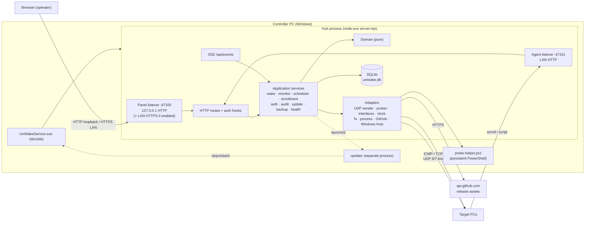
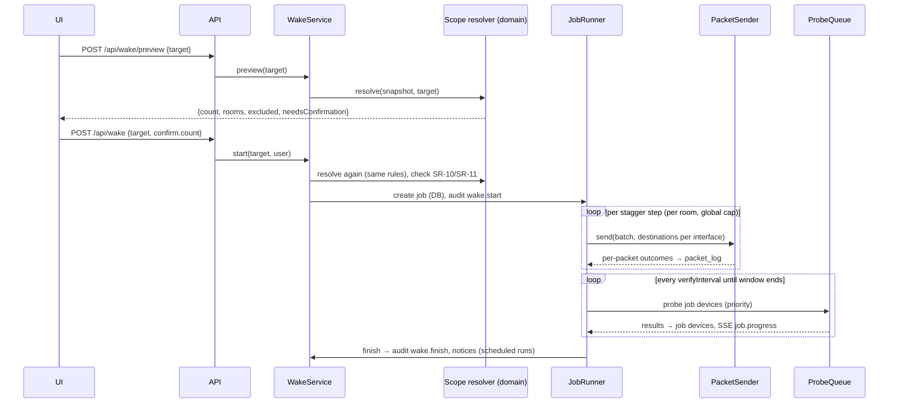
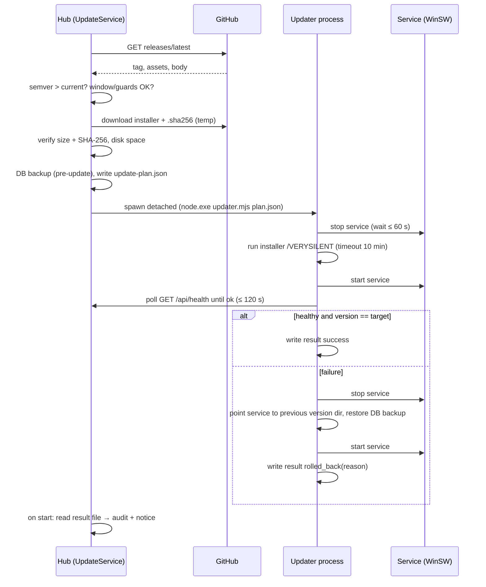

# UniWake — Technical Plan

Version: 0.1 (Architect draft, Phase 2) · Date: 2026-10-04
Inputs: `specs/constitution.md` v1.1, `specs/spec.md` v1.0, ADR-001..016.

---

## 1. Spikes run before this plan (dev machine, Node 24.15, Windows 11)
| Spike | Result | Consequence |
|---|---|---|
| `node:sqlite` | WAL, `synchronous=FULL`, prepared statements, transactions, `backup()` API and `VACUUM INTO` all work; unique violation → `errcode 2067`; no experimental warning printed. | Built-in driver is viable; no native addon. |
| `crypto.argon2('argon2id')` | Works; m=19 MiB, t=2, p=1 → 44 ms. | Built-in argon2id; no native addon. |
| ICMP via persistent PowerShell helper (`System.Net.NetworkInformation.Ping.SendPingAsync`) | 250 loopback pings in 528 ms including process start; status is a locale-independent enum. | Fast ICMP without admin rights or native code. |
| `ping.exe` | 64 concurrent spawns in 454 ms, but **output is localized** ("Resposta de… tempo<1ms"). | Fallback only; parse `TTL=` and exit code, not text. |
| `Get-NetIPConfiguration` | ~4 s per call. | Too slow at send time. |
| `route.exe print -4` | 73 ms; default-route rows are numeric. | Gateway detection by parsing `0.0.0.0 0.0.0.0 <gw> <ifaceIP> <metric>` rows. |
| `os.networkInterfaces()` | IPv4 address, netmask, CIDR, MAC; no gateway. | Combined with `route print` at send time. |

## 2. Architecture



### 2.1 Process model
- **Hub**: single Node process run by WinSW as a Windows Service. All DB access is synchronous
  (`node:sqlite`) on the main thread; queries must stay short (< 50 ms) and heavy aggregates are
  precomputed.
- **probe-helper.ps1**: a long-lived PowerShell child that answers JSON-line ICMP batch requests.
  Supervised: restarted on exit or when a request exceeds its deadline.
- **Updater**: separate process (see §8), launched detached by the hub.

## 3. Modules and boundaries
```
apps/server/src/
  domain/          pure: mac.ts, magic-packet.ts, destinations.ts, scope.ts, stagger.ts,
                   status.ts (state machine), schedule.ts (occurrences, DST), uptime.ts,
                   csv.ts (row mapping, injection escaping), semver.ts, smbios.ts
  application/     ports.ts (interfaces), wake/ (wake-service, job-runner), monitor/
                   (monitor-service, probe-queue), scheduler/, enrollment/, auth/, audit/,
                   settings/, update/, backup/, health/, notices/, events-bus.ts, demo/
  adapters/        udp-packet-sender, recording-packet-sender, ps-helper-icmp, tcp-prober,
                   composite-prober, simulated-prober (demo), network-interfaces (os + route),
                   system-clock, node-fs, process-runner, http-client (allowlist),
                   github-release-source, dns-resolver, windows-host (power plan, pending
                   reboot, active hours, service control), cert-generator
  db/              connection.ts, migrate.ts, migrations/NNN_name.sql, repositories/*.ts
  http/            server.ts (listeners), plugins/ (host-allowlist, security-headers,
                   session-auth, csrf-origin, rate-limit, error-handler, route-auth-registry),
                   routes/*.ts, sse.ts
  main.ts          composition root
  updater/main.ts  updater entry
packages/shared/src/
  schemas/         Zod schemas for every entity, request and response
  errors.ts        ErrorCode enum + pt-BR catalog
  settings.ts      settings schema + UI metadata (group, label pt-BR, input type, min/max)
  defaults.ts
apps/web/src/
  api/ (typed client), realtime/ (SSE hook), routes/ (pages), components/, i18n/pt-BR.ts
```
Boundary enforcement: ESLint `import/no-restricted-paths` zones —
`domain` imports only `domain` and `packages/shared`; `application` imports `domain`,
`application`, `shared`, never `adapters`/`db`/`http`; `http` never imports `adapters`;
only `main.ts`/`updater/main.ts` import everything. `node:dgram|net|dns|child_process` allowed
only in `adapters/`.

## 4. Technology choices (each becomes an ADR on consolidation)
| Area | Choice | Notes |
|---|---|---|
| DB driver | `node:sqlite` (built-in) | Wrapped in `db/connection.ts`; swappable to better-sqlite3 if needed. |
| Password hashing | `crypto.argon2` argon2id, m=19456 KiB, t=2, p=1, 16-byte salt, PHC string | OWASP minimum profile. |
| HTTP | Fastify 5, `@fastify/cookie`, `@fastify/static`, `@fastify/rate-limit`, `fastify-type-provider-zod` | |
| Validation | Zod (latest major supported by the Fastify type provider) | Shared by server and web. |
| Realtime | SSE | Server→client only, auto-reconnect, cookie auth. |
| ICMP | persistent PowerShell helper (.NET Ping); fallback `ping.exe` | |
| TCP probe | `node:net` connect with timeout; `ECONNREFUSED` = alive | |
| Gateway detection | `route.exe print -4` parsing | |
| Time zones | Luxon + our DST rule (ADR-008) | |
| Logging | pino + `rotating-file-stream` (10 MB × 10) | |
| CSV | `csv-parse` / `csv-stringify` | |
| SemVer | `semver` | |
| Web | React 19, Vite, Tailwind CSS 4, React Router, TanStack Query | No component library; native `<dialog>`. |
| Tests | Vitest, `fast-check` (property tests), Playwright + `@axe-core/playwright`, Pester 5 | |
| Lint | ESLint 9 flat config, typescript-eslint, eslint-plugin-import, react, react-hooks, Prettier | |
| Bundling | esbuild → single `server.mjs`, `updater.mjs` | |
| Service wrapper | WinSW 2.12 (x64) | Stable release; v3 still prerelease. |
| Installer | Inno Setup 6 | |
| TLS cert (LAN panel) | `New-SelfSignedCertificate` + `Export-PfxCertificate` via process runner | No extra dependency. |

## 5. Data model (SQLite)
All times are epoch ms UTC (`INTEGER`), booleans `INTEGER 0/1`, JSON in `TEXT`.

| Table | Columns (key ones) | Notes |
|---|---|---|
| `schema_migrations` | version PK, applied_at | |
| `rooms` | id PK, name UNIQUE, code UNIQUE, block, floor, color, notes, batch_size NULL, batch_delay_ms NULL, directed_broadcast NULL, created_at, updated_at | |
| `devices` | id PK, name, mac UNIQUE, ip, hostname, room_id FK→rooms ON DELETE SET NULL, notes, enabled, manufacturer, model, serial, os, other_macs JSON, prepared_at, prepare_results JSON, enrolled_at, created_at, updated_at | index room_id, ip, hostname |
| `device_state` | device_id PK FK CASCADE, status, latency_ms, last_seen_at, online_since, last_probe_at, consecutive_failures, ever_online | hot table, updated per sweep in one transaction |
| `tags` | id PK, name UNIQUE, color | |
| `device_tags` | device_id FK CASCADE, tag_id FK CASCADE, PK(device_id, tag_id) | index tag_id |
| `device_events` | id PK, device_id FK CASCADE, at, type (`status`,`ip_changed`,`moved`,`enrolled`), data JSON | index (device_id, at); retention 180 d |
| `daily_uptime` | device_id, day (`YYYY-MM-DD` local), online_ms, PK(device_id, day) | rolled up nightly + today on demand |
| `schedules` | id PK, name, enabled, weekdays (bitmask Mon=1…Sun=64), time_local `HH:mm`, timezone, only_offline, batch_size NULL, batch_delay_ms NULL, confirmed_count, created_by, created_at, updated_at | |
| `schedule_targets` | schedule_id FK CASCADE, type (`room`,`tag`,`device`,`all`,`no_room`), ref_id NULL | |
| `schedule_exceptions` | id PK, schedule_id NULL FK CASCADE (NULL = global), start_date, end_date, description | |
| `schedule_runs` | id PK, schedule_id FK, planned_at, claimed_at, status, detail, job_id NULL, **UNIQUE(schedule_id, planned_at)** | claim-then-execute |
| `wake_jobs` | id PK, source (`manual`,`schedule`,`test`), schedule_run_id NULL, requested_by NULL, target JSON, only_offline, dry_run, state, created_at, started_at, finished_at, verify_until, summary JSON | index state |
| `wake_job_devices` | job_id FK CASCADE, device_id, mac, room_id, batch_index, result, sent_at, woke_at, excluded_reason, PK(job_id, device_id) | index device_id (diagnostics) |
| `packet_log` | id PK, job_id, device_id, mac, src_ip, dst_ip, port, repeat, at, outcome, error | index job_id, device_id; retention 30 d |
| `users` | id PK, username UNIQUE, password_hash, role, enabled, failed_logins, last_failed_at, created_at, password_changed_at | |
| `sessions` | id_hash PK, user_id FK CASCADE, created_at, last_seen_at, expires_at, ip, user_agent | |
| `audit_log` | id PK, at, actor_user_id NULL, actor_label, action, target, result, source_ip, details JSON | append-only; index at, action |
| `settings` | key PK, value JSON, updated_at, updated_by | |
| `system_state` | key PK, value JSON | pause state, update state, last checks |
| `enrollment_tokens` | id PK, token_hash UNIQUE, room_id FK CASCADE, created_by, created_at, expires_at, max_uses, uses, revoked_at | |
| `notices` | id PK, type, created_at, data JSON, acknowledged_at, acknowledged_by | morning result, enroll-moved, update-failed |
| `backups` | id PK, file, kind (`daily`,`pre-migration`,`pre-update`,`pre-restore`,`manual`), created_at, size | files in `backups/` |

## 6. API contract
All JSON. Errors: `{ code, message, details? }` (ADR-006). Every route declares `auth`.

### 6.1 Panel listener (`/api`)
| Method & path | Auth | Purpose |
|---|---|---|
| GET `/api/health` | public | `{status}` |
| GET `/api/health/details` | operator | FR-012 |
| GET `/api/auth/setup-status` | public | `{needsSetup}` |
| POST `/api/auth/setup` | public (loopback + no users) | create first admin |
| POST `/api/auth/login` · POST `/api/auth/logout` · GET `/api/auth/me` · POST `/api/auth/password` | public / operator | sessions |
| GET, POST `/api/users`; PATCH `/api/users/:id`; POST `/api/users/:id/reset-password` | admin | FR-006.2 |
| GET, POST `/api/rooms`; GET, PATCH, DELETE `/api/rooms/:id`; GET `/api/rooms/:id/delete-impact` | operator | FR-008 |
| GET, POST `/api/tags`; PATCH, DELETE `/api/tags/:id` | operator | FR-008.2 |
| GET `/api/devices` (filters: room, tag, status, q, page) ; POST `/api/devices`; GET, PATCH, DELETE `/api/devices/:id`; POST `/api/devices/bulk` | operator | FR-002 |
| GET `/api/devices/:id/diagnostics` · GET `/api/devices/:id/history` | operator | FR-010, FR-004.6 |
| GET `/api/devices/export.csv`; POST `/api/devices/import/preview`; POST `/api/devices/import/commit` | operator | FR-002.3 |
| POST `/api/wake/preview` · POST `/api/wake` | operator | FR-003.3 |
| GET `/api/jobs` · GET `/api/jobs/:id` · GET `/api/jobs/:id/packets` | operator | FR-009, FR-003.6 |
| POST `/api/devices/:id/test-wol` · GET `/api/test-wol/:id` · POST `/api/test-wol/:id/cancel` | operator | FR-007.4 |
| GET `/api/dashboard` · GET `/api/uptime` | operator | FR-004.5/6 |
| GET, POST `/api/schedules`; GET, PATCH, DELETE `/api/schedules/:id`; GET `/api/schedules/:id/next-runs` | operator | FR-005 |
| GET `/api/schedule-runs` · GET, POST, DELETE `/api/schedule-exceptions[/:id]` | operator | FR-005.2/7 |
| POST `/api/scheduler/pause` · POST `/api/scheduler/resume` | operator | FR-005.6 |
| GET, POST `/api/enrollment/tokens`; POST `/api/enrollment/tokens/:id/revoke`; GET `/api/enrollment/addresses`; POST `/api/enrollment/command` | operator | FR-007.3 |
| GET `/api/notices` · POST `/api/notices/:id/ack` | operator | FR-013 |
| GET, PATCH `/api/settings` · GET `/api/network/interfaces` | admin | FR-016, FR-011 |
| GET `/api/update` | operator | FR-001.2 status |
| POST `/api/update/check` · POST `/api/update/install` | admin | FR-001.3 |
| GET, POST `/api/backups` · POST `/api/backups/:id/restore` | admin | FR-014 |
| GET `/api/logs` · GET `/api/logs/download` | admin | FR-016 |
| GET `/api/audit` · GET `/api/audit/export.csv` | operator | FR-006.5 |
| GET `/api/events` (SSE) | operator | FR-004.4 |
| GET `/*` | public | SPA static files (index.html fallback) |

### 6.2 Agent listener
| Method & path | Auth | Purpose |
|---|---|---|
| GET `/api/health` | public | `{status}` |
| POST `/agent/enroll` | enrollment (token) | FR-007.2 |
| GET `/agent/prepare-target.ps1` | public | script bytes (hash-pinned by the command) |

### 6.3 SSE events
`device.status` `{deviceId, status, latencyMs, lastSeenAt}` · `counters` `{global, rooms[]}` ·
`job.progress` `{jobId, state, counts}` · `job.device` `{jobId, deviceId, result}` ·
`notice` `{id, type}` · `scheduler` `{paused, nextRun}` · heartbeat comment every 20 s.
On reconnect the client refetches `/api/dashboard` (AC-004-14).

### 6.4 Error codes (initial catalog)
`VALIDATION_FAILED`, `UNAUTHENTICATED`, `FORBIDDEN`, `NOT_FOUND`, `RATE_LIMITED`,
`HOST_NOT_ALLOWED`, `ORIGIN_NOT_ALLOWED`, `SETUP_NOT_ALLOWED`, `SETUP_ALREADY_DONE`,
`LOGIN_INVALID`, `LOGIN_THROTTLED`, `PASSWORD_TOO_WEAK`, `USER_DISABLED`,
`DEVICE_MAC_DUPLICATE`, `DEVICE_NOT_FOUND`, `MAC_INVALID`, `IP_INVALID`, `ROOM_NAME_DUPLICATE`,
`ROOM_CODE_DUPLICATE`, `TAG_NAME_DUPLICATE`, `CSV_INVALID`, `CSV_TOO_LARGE`,
`CONFIRMATION_REQUIRED`, `WAKE_ALREADY_RUNNING`, `WAKE_TARGET_EMPTY`, `NO_NETWORK_INTERFACE`,
`PAUSE_REASON_REQUIRED`, `ENROLL_TOKEN_INVALID`, `ENROLL_TOKEN_EXPIRED`,
`ENROLL_TOKEN_REVOKED`, `ENROLL_TOKEN_EXHAUSTED`, `ENROLL_ROOM_MISMATCH`,
`UPDATE_NOT_AVAILABLE`, `UPDATE_IN_PROGRESS`, `UPDATE_BLOCKED_BY_SCHEDULE`,
`CHECKSUM_MISMATCH`, `DOWNLOAD_FAILED`, `BACKUP_NOT_FOUND`, `RESTORE_CONFIRMATION_MISMATCH`,
`INTERNAL_ERROR`.

## 7. Key flows

### 7.1 Wake job


### 7.2 Scheduler tick (every 15 s)
1. If paused and auto-resume passed → resume (audit).
2. For each enabled schedule, compute occurrences in `(lastTick - grace, now]` (domain).
3. For the most recent due occurrence: if excepted → insert run `pulado (feriado)`; if paused →
   `pulado (pausa)`; else **INSERT run (claim)**; on unique violation → skip; on success → start
   wake job (source `schedule`), status `executado` or `atrasado`.
4. Older due occurrences without a run → `perdido`.
`lastTick` is persisted in `system_state`; at startup `lastTick = max(persisted, now - grace)`.

### 7.3 Enrollment
Agent `POST /agent/enroll` → rate limit (IP) → body ≤ 8 KB → Zod → token hash lookup → checks
(revoked, expired, exhausted, room code) → upsert device by MAC (create / update / move) →
increment uses → audit → notice if moved → response `{result, deviceId, room}` with pt-BR message.

## 8. Update and rollback


## 9. Installer and runtime layout
```
%ProgramFiles%\UniWake\
  UniWakeService.exe            WinSW x64 (renamed)
  UniWakeService.xml            executable = versions\<ver>\node.exe, args = server.mjs
  versions\<ver>\               node.exe (pinned), server.mjs, updater.mjs, web\,
                                scripts\prepare-target.ps1, helper\probe-helper.ps1, VERSION
  versions\<previous>\          kept for rollback (older ones removed by the installer)
%ProgramData%\UniWake\          ACL: SYSTEM + Administrators only
  config.json  data\uniwake.db  backups\  logs\  updates\  certs\
```
- Service: `UniWake`, account LocalSystem (needed to run installers, manage firewall rules and
  the certificate store), start Automatic, failure actions restart after 10 s / 30 s / 60 s.
- Firewall: inbound TCP 47100 and 47101, profiles Domain + Private.
- Node runtime: official `node-v24.x.y-win-x64.zip`, version pinned in `build/node-version.txt`,
  verified against `SHASUMS256.txt` in CI.

## 10. Timeouts and limits (constitution §4.1)
| Operation | Default |
|---|---|
| GitHub API request | connect 10 s, total 30 s |
| Installer download | idle 60 s, total 10 min |
| ICMP probe / TCP probe | 1000 ms / 800 ms |
| Probe-helper request deadline | probe timeout + 3 s, then helper restart |
| DNS resolution | 2 s |
| SQLite busy timeout | 5 s |
| HTTP request timeout / body limit | 30 s / 1 MB (CSV 2 MB, enroll 8 KB) |
| SSE heartbeat | 20 s |
| Graceful shutdown | 15 s |
| Updater: service stop / installer / health | 60 s / 10 min / 120 s |
| Process runner default | 30 s |

## 11. Testing strategy
- **Unit (domain)**: pure functions, property tests for scope resolution (AC-003-18) and MAC
  normalization; DST matrix for `schedule.ts`.
- **Integration (application + db)**: in-memory SQLite with migrations; fake clock, fake sender,
  fake prober, fake interfaces with fault injection.
- **API**: `fastify.inject` against the composed app with fakes; route-table authz test per
  listener; host/origin tests.
- **E2E**: Playwright against `server.mjs --demo` with a temp data dir; axe checks.
- **PowerShell**: Pester 5 with mocked NetAdapter/registry/firewall cmdlets.
- **Windows smoke (CI)**: on `windows-latest`, build installer, install silently, health 200,
  upgrade over itself with a bumped version, uninstall (AC-001-01a/02/03).
- **Network guard**: Vitest global setup patches `dgram`/`net` to throw on non-loopback.

## 12. CI/CD
- `ci.yml` (push, PR): ubuntu job (lint, typecheck, unit/integration/API with coverage, E2E,
  audit, secret scan) + windows job (Pester, PSScriptAnalyzer, probe-helper contract test on
  loopback, installer smoke).
- `release.yml` (tag `v*`): reruns gates, builds bundle + installer on windows, computes SHA-256,
  publishes Release with generated notes. Workflow `permissions: contents: read`, release job
  `contents: write`.
- Dependabot: npm + github-actions weekly.

## 13. Risk register
| ID | Risk | Likelihood | Impact | Mitigation |
|---|---|---|---|---|
| RK-01 | Targets in other VLANs never receive packets | High | High | Per-room directed broadcast; diagnostics "outra sub-rede"; help page; B-003; roadmap relay RM-1. |
| RK-02 | Fast Startup / NIC power settings prevent wake | High | High | prepare-target; diagnostics; "parou de acordar" flag. |
| RK-03 | ICMP blocked → false offline | High | Medium | TCP probe incl. refused = online; ICMP rule in prepare-target; "nunca respondeu". |
| RK-04 | LocalSystem service = large blast radius | Medium | High | execFile with arg arrays only; no user input in command text; ACL'd data dir; minimal LAN surface. |
| RK-05 | AV/SmartScreen flags installer or PowerShell helper | Medium | Medium | Service context avoids SmartScreen; ping.exe fallback; signing when B-001 resolved. |
| RK-06 | Clock drift | Medium | Medium | Tick-based scheduler; skew warning from GitHub `Date`. |
| RK-07 | DST / tz changes | Low (BR) | Medium | ADR-008 rules + tests; tzdata ships with Node updates. |
| RK-08 | `node:sqlite` API changes across Node versions | Low | Medium | Node version pinned per release; DB wrapper with tests. |
| RK-09 | Multi-NIC controller sends limited broadcast on the wrong NIC | High | High | Bind per interface (spec FR-003.2). |
| RK-10 | Ports 47100/47101 already in use | Low | High | Configurable; clear startup error in log and Windows event log; health. |
| RK-11 | Disk full (logs, backups, downloads) | Low | High | Rotation, retention, free-space check before download/backup. |
| RK-12 | Windows Update reboots controller near 06:50 | Medium | High | Grace window; network-retry; health warnings (FR-012). |
| RK-13 | GitHub unauthenticated rate limit (60/h) | Low | Low | 4 checks/day. |
